# Image credits and scoped display evidence

These are authentic, record-specific game images with file-specific provenance and rights evidence. Some have inspected licenses; official-source images may instead retain an explicit unresolved-rights label and a narrow user-directed local-display scope. Each entry states whether the image is pinned in the indexed repository or is a separate official/historical/collection capture. Images do not establish that HeadStart played the game. Originals are retained byte-for-byte. The contact sheet scales copies to fit; it does not crop or alter game content. There is no blanket license for third-party imagery.

Retain this file, the media manifest, license notices, original images and linked source evidence when distributing the preview bundle. GPL-covered originals and their available game/source references are linked below; follow the listed license obligations for any further redistribution or adaptation. The metadata snapshot records the file-page assertions inspected during research, not a warranty of ownership.

## 01. 2048

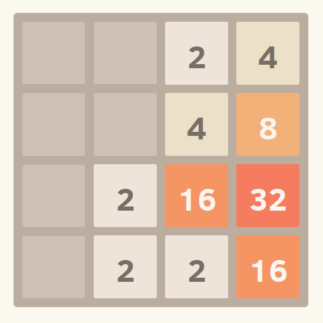

Credit: Gabriele Cirulli

Rights expression: **MIT**. [rights evidence](https://opensource.org/license/mit).

Allowed use: Catalog display and redistributed original/thumbnail only with the listed attribution, license notices and applicable share-alike/source obligations. No endorsement implied.

[Exact rights/provenance evidence](https://commons.wikimedia.org/w/index.php?title=File%3A2048+Screenshot.png&oldid=774775920) · [Original image](https://upload.wikimedia.org/wikipedia/commons/6/64/2048_Screenshot.png) · [Project reference](https://github.com/gabrielecirulli/2048)

Capture date: 2014-03-19 12:20:41 (source_declared). Uploaded: 2014-03-19T16:21:39Z. Downloaded: 2026-09-10T17:32:37.260932+00:00.

Historical image; relation to indexed source commit is unknown. Not a current build or play attestation. Scope review concerns this exact image only, not all game assets or source extraction.

Changes: Original image bytes retained unchanged; contact sheet scales an independent copy to fit, without content edits.

SHA256: `fda05378852e68a61e1607cf91082ec774356078c5c4af64e5684c50a40b9d6f`. Dimensions: 548 × 549.

## 02. Thunderfall

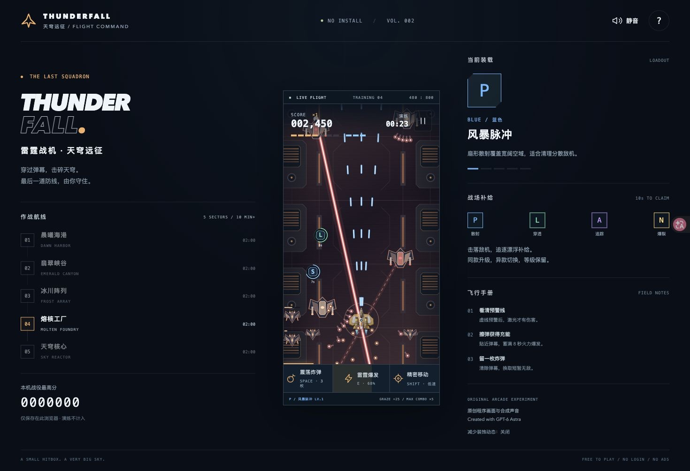

Credit: jackroc and contributors

Rights expression: **CC0-1.0**. [rights evidence](https://creativecommons.org/publicdomain/zero/1.0/).

Allowed use: Local HeadStart catalog identification and preview display for this repository-included image under the listed terms; no broader game-asset reuse, endorsement or model-quality claim.

[Exact rights/provenance evidence](https://github.com/MartinDelophy/awesome-gpt-6-astra/blob/139a9287e763e5b592bb53fda97e5101db15db40/LICENSE) · [Original image](https://raw.githubusercontent.com/MartinDelophy/awesome-gpt-6-astra/139a9287e763e5b592bb53fda97e5101db15db40/assets/screenshots/thunderfall/gameplay.jpg) · [Project reference](https://github.com/MartinDelophy/awesome-gpt-6-astra)

Capture date: unknown (unknown). Uploaded: unknown. Downloaded: 2026-09-10T21:01:01.661078+00:00.

Separate curated gameplay capture; its exact game-build relation to the indexed source commit is unknown. Not a HeadStart playthrough or target-integration attestation. File-specific local display review only. The repository-level license is applied only where this selected image is included in that licensed tree and no narrower file notice was found. Underlying assets, dependencies, public publication and code extraction retain the record's separate rights limits.

Changes: Original bytes retained unchanged; browser display and contact sheet may scale without cropping.

SHA256: `0d1cda2750293876526eb8752debb1c6ebc7e2a2c281b93c6a22e2e5870f8e0a`. Dimensions: 1470 × 1005.

## 03. Blackwater

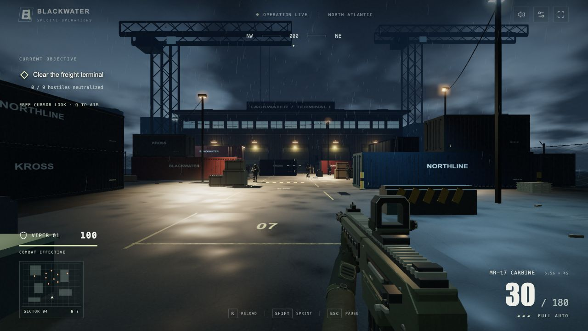

Credit: Hiraeth010 and contributors

Rights expression: **MIT AND CC0-1.0**. [rights evidence](https://opensource.org/license/mit), [rights evidence](https://creativecommons.org/publicdomain/zero/1.0/).

Allowed use: Local HeadStart research-preview identification only. MIT covers the named game's repository content and CC0 covers the collection capture; depicted third-party rights, publication and game-asset reuse remain separately unresolved.

[Exact rights/provenance evidence](https://github.com/MartinDelophy/awesome-gpt-6-astra/blob/139a9287e763e5b592bb53fda97e5101db15db40/LICENSE) · [Original image](https://raw.githubusercontent.com/MartinDelophy/awesome-gpt-6-astra/139a9287e763e5b592bb53fda97e5101db15db40/assets/screenshots/blackwater/gameplay.jpg) · [Project reference](https://github.com/Hiraeth010/blackwater)

Capture date: unknown (unknown). Uploaded: unknown. Downloaded: 2026-09-10T21:01:01.661078+00:00.

Separate curated gameplay capture; its exact game-build relation to the indexed source commit is unknown. Not a HeadStart playthrough or target-integration attestation. File-specific local display review only. The repository-level license is applied only where this selected image is included in that licensed tree and no narrower file notice was found. Underlying assets, dependencies, public publication and code extraction retain the record's separate rights limits.

Changes: Original bytes retained unchanged; browser display and contact sheet may scale without cropping.

SHA256: `0ffdf45c843dc5b5e7257037cbf00ef661ff78fb3ecafd3f25171754fd7a5dfa`. Dimensions: 1280 × 720.

## 04. Drei

Credit: pmndrs and contributors

Rights expression: **MIT**. [rights evidence](https://github.com/pmndrs/drei/blob/ffa15b956e320391b0e86084cb58c8da0445abe3/LICENSE).

Allowed use: Independent narrow local research-display review passed for this exact audited image. The approval is limited to identifying the upstream project in the local HeadStart catalog; it does not authorize public redistribution, source export, promotional reuse, relicensing, game-asset reuse, endorsement, or imply that third-party assets are covered by the code license.

[Exact rights/provenance evidence](https://github.com/pmndrs/drei/blob/ffa15b956e320391b0e86084cb58c8da0445abe3/LICENSE) · [Original image](https://raw.githubusercontent.com/pmndrs/drei/ffa15b956e320391b0e86084cb58c8da0445abe3/.storybook/public/images/share-screen.jpg) · [Project reference](https://github.com/pmndrs/drei)

Capture date: unknown (unknown). Uploaded: unknown. Downloaded: 2026-09-10T21:01:01.661078+00:00.

Pinned repository documentation/demo overview image. This image identifies the named catalog record but is not a HeadStart playthrough, source/deployment parity check or integration attestation. Independent narrow local research-display review passed. This is a library/demo image, not evidence of one complete game.

Changes: Original bytes retained unchanged; browser display and contact sheet may scale without cropping.

SHA256: `ba9fbdb0326a92aaca59510808770ff378c2177f66f7f514f38a337538cf8884`. Dimensions: 1138 × 640.

## 05. Dungeon Forge

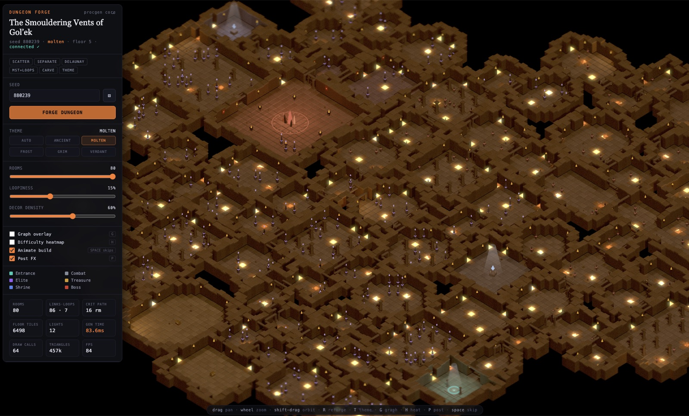

Credit: majidmanzarpour and contributors

Rights expression: **MIT**. [rights evidence](https://opensource.org/license/mit).

Allowed use: Local HeadStart catalog identification and preview display for this repository-included image under the listed terms; no broader game-asset reuse, endorsement or model-quality claim.

[Exact rights/provenance evidence](https://github.com/majidmanzarpour/threejs-procedural-dungeon/blob/0a2aa0980028cbbc77af6642b4232b45713dc5de/LICENSE) · [Original image](https://raw.githubusercontent.com/majidmanzarpour/threejs-procedural-dungeon/0a2aa0980028cbbc77af6642b4232b45713dc5de/docs/preview.jpg) · [Project reference](https://github.com/majidmanzarpour/threejs-procedural-dungeon)

Capture date: unknown (unknown). Uploaded: unknown. Downloaded: 2026-09-10T21:01:01.661078+00:00.

Image file pinned in the named repository at the indexed source commit; not a HeadStart playthrough or target-integration attestation. File-specific local display review only. The repository-level license is applied only where this selected image is included in that licensed tree and no narrower file notice was found. Underlying assets, dependencies, public publication and code extraction retain the record's separate rights limits.

Changes: Original bytes retained unchanged; browser display and contact sheet may scale without cropping.

SHA256: `256d06c9a586f934a7faf20660bf6bcc23b0570a4ce7be3c93c8afe9d8b20f3c`. Dimensions: 1600 × 967.

## 06. Ecctrl

Credit: Erdong Chen and contributors

Rights expression: **MIT**. [rights evidence](https://opensource.org/license/mit).

Allowed use: Local HeadStart catalog identification and preview display for this repository-included image under the listed terms; no broader game-asset reuse, endorsement or model-quality claim.

[Exact rights/provenance evidence](https://github.com/pmndrs/ecctrl/blob/e2cab804f9f15661a642e76f52d09f0b2db63f35/LICENSE) · [Original image](https://raw.githubusercontent.com/pmndrs/ecctrl/e2cab804f9f15661a642e76f52d09f0b2db63f35/docs/images/ecctrl-hero.gif) · [Project reference](https://github.com/pmndrs/ecctrl)

Capture date: unknown (unknown). Uploaded: unknown. Downloaded: 2026-09-10T21:01:01.661078+00:00.

Image file pinned in the named repository at the indexed source commit; not a HeadStart playthrough or target-integration attestation. File-specific local display review only. The repository-level license is applied only where this selected image is included in that licensed tree and no narrower file notice was found. Underlying assets, dependencies, public publication and code extraction retain the record's separate rights limits.

Changes: Original bytes retained unchanged; browser display and contact sheet may scale without cropping.

SHA256: `d9f7f6d44c393b0d3e953640ae5ea3d1247445a834578ec29cdbe747f325c10a`. Dimensions: 400 × 248.

## 07. Fable Cities

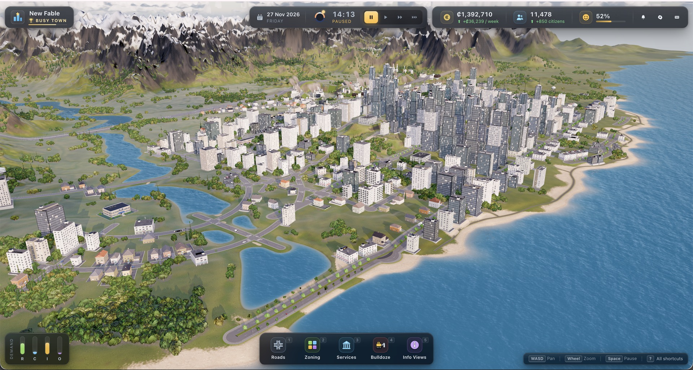

Credit: rawprogress and contributors

Rights expression: **MIT**. [rights evidence](https://opensource.org/license/mit).

Allowed use: Local HeadStart catalog identification and preview display for this repository-included image under the listed terms; no broader game-asset reuse, endorsement or model-quality claim.

[Exact rights/provenance evidence](https://github.com/rawprogress/fable-cities/blob/aea8b1035030952555395de0c1de14ba693a1427/LICENSE) · [Original image](https://raw.githubusercontent.com/rawprogress/fable-cities/aea8b1035030952555395de0c1de14ba693a1427/assets/hero.jpg) · [Project reference](https://github.com/rawprogress/fable-cities)

Capture date: unknown (unknown). Uploaded: unknown. Downloaded: 2026-09-10T21:01:01.661078+00:00.

Image file pinned in the named repository at the indexed source commit; not a HeadStart playthrough or target-integration attestation. File-specific local display review only. The repository-level license is applied only where this selected image is included in that licensed tree and no narrower file notice was found. Underlying assets, dependencies, public publication and code extraction retain the record's separate rights limits.

Changes: Original bytes retained unchanged; browser display and contact sheet may scale without cropping.

SHA256: `0590917b638e138ebb348e56b3748c71844ef2d6b9568f57b9906f06e97111f3`. Dimensions: 1920 × 1026.

## 08. LAAS

Credit: Braffolk and contributors

Rights expression: **MIT**. [rights evidence](https://opensource.org/license/mit).

Allowed use: Local HeadStart catalog identification and preview display for this repository-included image under the listed terms; no broader game-asset reuse, endorsement or model-quality claim.

[Exact rights/provenance evidence](https://github.com/Braffolk/fable5-world-demo/blob/fd75fdb718996908aad3d22b59dfa297dc94298d/LICENSE) · [Original image](https://raw.githubusercontent.com/Braffolk/fable5-world-demo/fd75fdb718996908aad3d22b59dfa297dc94298d/docs/readme-hero.jpg) · [Project reference](https://github.com/Braffolk/fable5-world-demo)

Capture date: unknown (unknown). Uploaded: unknown. Downloaded: 2026-09-10T21:01:01.661078+00:00.

Image file pinned in the named repository at the indexed source commit; not a HeadStart playthrough or target-integration attestation. File-specific local display review only. The repository-level license is applied only where this selected image is included in that licensed tree and no narrower file notice was found. Underlying assets, dependencies, public publication and code extraction retain the record's separate rights limits.

Changes: Original bytes retained unchanged; browser display and contact sheet may scale without cropping.

SHA256: `d3fcd08f8f8afb633490665c55886498718aa0b90838339699f713984a9568b7`. Dimensions: 1928 × 1238.

## 09. Godot AStarGrid2D Navigation

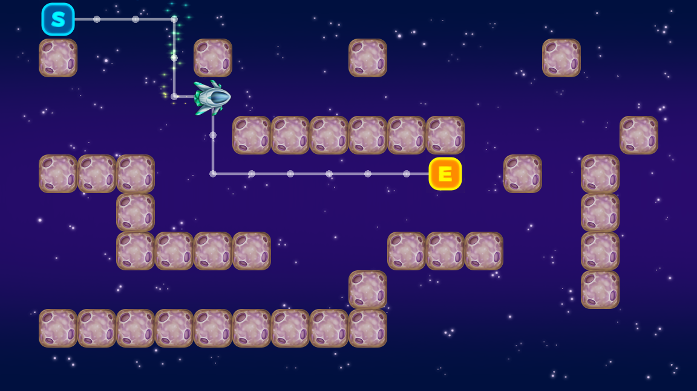

Credit: Godot Engine contributors; see subproject credits

Rights expression: **MIT**. [rights evidence](https://github.com/godotengine/godot-demo-projects/blob/a3b5c113112f77291d5f3d1360f33a882fdc52f7/LICENSE.md).

Allowed use: Independent narrow local research-display review passed for this exact audited image. The approval is limited to identifying the upstream project in the local HeadStart catalog; it does not authorize public redistribution, source export, promotional reuse, relicensing, game-asset reuse, endorsement, or imply that third-party assets are covered by the code license.

[Exact rights/provenance evidence](https://github.com/godotengine/godot-demo-projects/blob/a3b5c113112f77291d5f3d1360f33a882fdc52f7/LICENSE.md) · [Original image](https://raw.githubusercontent.com/godotengine/godot-demo-projects/a3b5c113112f77291d5f3d1360f33a882fdc52f7/2d/navigation_astar/screenshots/navigation_astar.webp) · [Project reference](https://github.com/godotengine/godot-demo-projects)

Capture date: unknown (unknown). Uploaded: unknown. Downloaded: 2026-09-10T21:01:01.661078+00:00.

Pinned subproject screenshot. This image identifies the named catalog record but is not a HeadStart playthrough, source/deployment parity check or integration attestation. Independent narrow local research-display review passed. Review subproject-specific asset credits before reuse.

Changes: Original bytes retained unchanged; browser display and contact sheet may scale without cropping.

SHA256: `b33e2e80bdb1ae471df51caab48af2c9cea8bfc06cc53a42474579092778b89c`. Dimensions: 1152 × 648.

## 10. Godot 2D Platformer

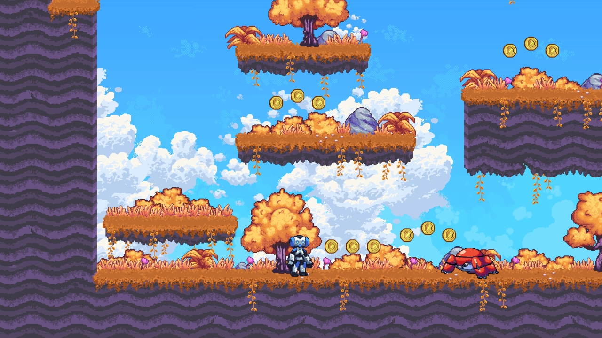

Credit: Godot Engine contributors; see subproject credits

Rights expression: **MIT**. [rights evidence](https://github.com/godotengine/godot-demo-projects/blob/a3b5c113112f77291d5f3d1360f33a882fdc52f7/LICENSE.md).

Allowed use: Independent narrow local research-display review passed for this exact audited image. The approval is limited to identifying the upstream project in the local HeadStart catalog; it does not authorize public redistribution, source export, promotional reuse, relicensing, game-asset reuse, endorsement, or imply that third-party assets are covered by the code license.

[Exact rights/provenance evidence](https://github.com/godotengine/godot-demo-projects/blob/a3b5c113112f77291d5f3d1360f33a882fdc52f7/LICENSE.md) · [Original image](https://raw.githubusercontent.com/godotengine/godot-demo-projects/a3b5c113112f77291d5f3d1360f33a882fdc52f7/2d/platformer/screenshots/platformer.webp) · [Project reference](https://github.com/godotengine/godot-demo-projects)

Capture date: unknown (unknown). Uploaded: unknown. Downloaded: 2026-09-10T21:01:01.661078+00:00.

Pinned subproject gameplay screenshot. This image identifies the named catalog record but is not a HeadStart playthrough, source/deployment parity check or integration attestation. Independent narrow local research-display review passed. Review subproject-specific asset credits before reuse.

Changes: Original bytes retained unchanged; browser display and contact sheet may scale without cropping.

SHA256: `ef5eb833df4cf3618e92c4e5853e944e5999f8c9933ca21efd02dd87fea3502c`. Dimensions: 1280 × 720.

## 11. Godot 3D Platformer

Credit: Godot Engine contributors; see subproject credits

Rights expression: **MIT**. [rights evidence](https://github.com/godotengine/godot-demo-projects/blob/a3b5c113112f77291d5f3d1360f33a882fdc52f7/LICENSE.md).

Allowed use: Independent narrow local research-display review passed for this exact audited image. The approval is limited to identifying the upstream project in the local HeadStart catalog; it does not authorize public redistribution, source export, promotional reuse, relicensing, game-asset reuse, endorsement, or imply that third-party assets are covered by the code license.

[Exact rights/provenance evidence](https://github.com/godotengine/godot-demo-projects/blob/a3b5c113112f77291d5f3d1360f33a882fdc52f7/LICENSE.md) · [Original image](https://raw.githubusercontent.com/godotengine/godot-demo-projects/a3b5c113112f77291d5f3d1360f33a882fdc52f7/3d/platformer/screenshots/platformer.webp) · [Project reference](https://github.com/godotengine/godot-demo-projects)

Capture date: unknown (unknown). Uploaded: unknown. Downloaded: 2026-09-10T21:01:01.661078+00:00.

Pinned subproject gameplay screenshot. This image identifies the named catalog record but is not a HeadStart playthrough, source/deployment parity check or integration attestation. Independent narrow local research-display review passed. Review subproject-specific asset credits before reuse.

Changes: Original bytes retained unchanged; browser display and contact sheet may scale without cropping.

SHA256: `ecc6228fd200ddbde9d21707e7ffea1bd24ac59592a92aa2e33cabea91706a88`. Dimensions: 1280 × 720.

## 12. Godot Truck Town

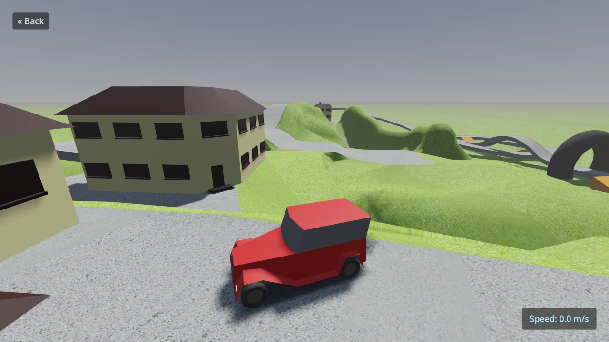

Credit: Godot Engine contributors; see subproject credits

Rights expression: **MIT**. [rights evidence](https://github.com/godotengine/godot-demo-projects/blob/a3b5c113112f77291d5f3d1360f33a882fdc52f7/LICENSE.md).

Allowed use: Independent narrow local research-display review passed for this exact audited image. The approval is limited to identifying the upstream project in the local HeadStart catalog; it does not authorize public redistribution, source export, promotional reuse, relicensing, game-asset reuse, endorsement, or imply that third-party assets are covered by the code license.

[Exact rights/provenance evidence](https://github.com/godotengine/godot-demo-projects/blob/a3b5c113112f77291d5f3d1360f33a882fdc52f7/LICENSE.md) · [Original image](https://raw.githubusercontent.com/godotengine/godot-demo-projects/a3b5c113112f77291d5f3d1360f33a882fdc52f7/3d/truck_town/screenshots/truck_town.webp) · [Project reference](https://github.com/godotengine/godot-demo-projects)

Capture date: unknown (unknown). Uploaded: unknown. Downloaded: 2026-09-10T21:01:01.661078+00:00.

Pinned subproject gameplay screenshot. This image identifies the named catalog record but is not a HeadStart playthrough, source/deployment parity check or integration attestation. Independent narrow local research-display review passed. Review subproject-specific asset credits before reuse.

Changes: Original bytes retained unchanged; browser display and contact sheet may scale without cropping.

SHA256: `7d7e38da059e04b0b948b35e6898cbf5483bd54163efd6d3741b18fcbc2f30e4`. Dimensions: 1280 × 720.

## 13. HexGL

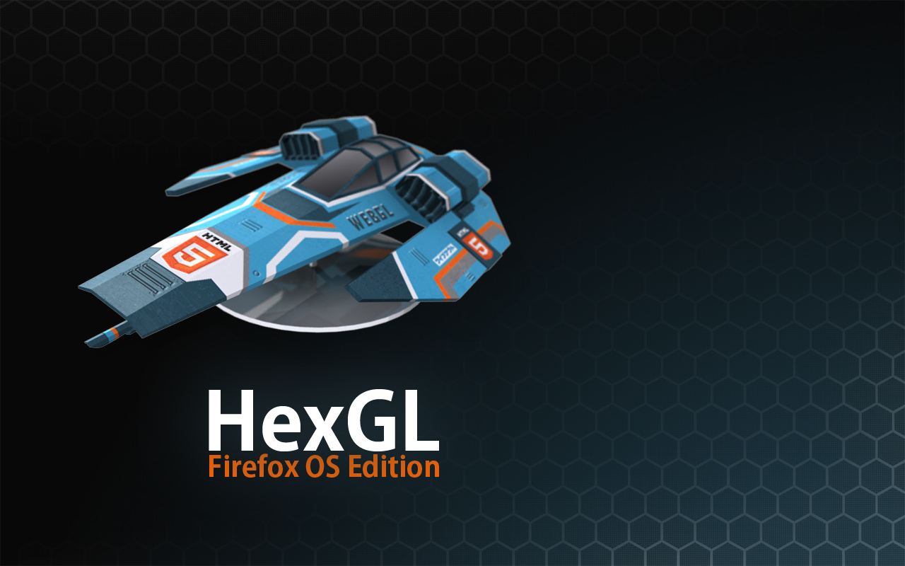

Credit: Thibaut Despoulain and contributors

Rights expression: **MIT**. [rights evidence](https://opensource.org/license/mit).

Allowed use: Local HeadStart catalog identification and preview display for this repository-included image under the listed terms; no broader game-asset reuse, endorsement or model-quality claim.

[Exact rights/provenance evidence](https://github.com/BKcore/HexGL/blob/6addc95a2fce3bf05f4d751823cc054c61a16d68/LICENSE) · [Original image](https://raw.githubusercontent.com/BKcore/HexGL/6addc95a2fce3bf05f4d751823cc054c61a16d68/css/mobile.jpg) · [Project reference](https://github.com/BKcore/HexGL)

Capture date: unknown (unknown). Uploaded: unknown. Downloaded: 2026-09-10T21:01:01.661078+00:00.

Image file pinned in the named repository at the indexed source commit; not a HeadStart playthrough or target-integration attestation. File-specific local display review only. The repository-level license is applied only where this selected image is included in that licensed tree and no narrower file notice was found. Underlying assets, dependencies, public publication and code extraction retain the record's separate rights limits.

Changes: Original bytes retained unchanged; browser display and contact sheet may scale without cropping.

SHA256: `47a8905d72243b83964700a26cf62830abf8e69498f27658ea2620a732393d0e`. Dimensions: 1280 × 800.

## 14. Jelly Baby

Credit: scottstts and contributors

Rights expression: **GPL-3.0-only**. [rights evidence](https://www.gnu.org/licenses/gpl-3.0.html).

Allowed use: Local HeadStart catalog identification and preview display for this repository-included image under the listed terms; no broader game-asset reuse, endorsement or model-quality claim.

[Exact rights/provenance evidence](https://github.com/scottstts/Jelly-Baby/blob/a36879ca47a890638ed9e4feaf98304e4c8c417e/LICENSE) · [Original image](https://raw.githubusercontent.com/scottstts/Jelly-Baby/a36879ca47a890638ed9e4feaf98304e4c8c417e/assets/screenshot.jpeg) · [Project reference](https://github.com/scottstts/Jelly-Baby)

Capture date: unknown (unknown). Uploaded: unknown. Downloaded: 2026-09-10T21:01:01.661078+00:00.

Image file pinned in the named repository at the indexed source commit; not a HeadStart playthrough or target-integration attestation. File-specific local display review only. The repository-level license is applied only where this selected image is included in that licensed tree and no narrower file notice was found. Underlying assets, dependencies, public publication and code extraction retain the record's separate rights limits.

Changes: Original bytes retained unchanged; browser display and contact sheet may scale without cropping.

SHA256: `ba4ac9b691356a3e4aee32ac8350b9fd558587fd2a031168f9f4350be892156e`. Dimensions: 2160 × 1432.

## 15. Last Beacon

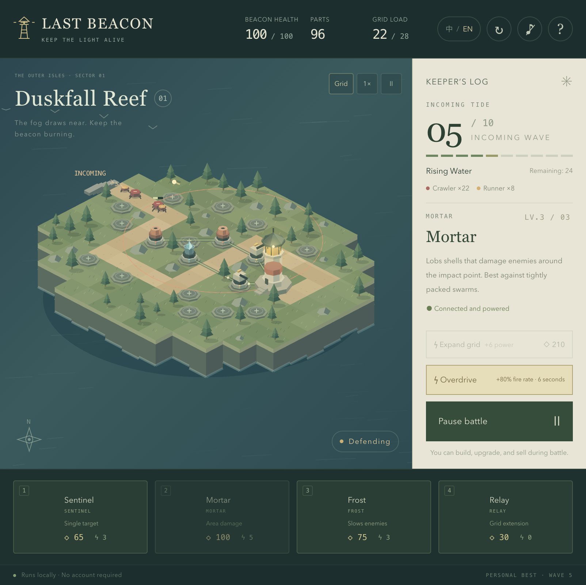

Credit: stackloomdev and contributors

Rights expression: **MIT AND CC0-1.0**. [rights evidence](https://opensource.org/license/mit), [rights evidence](https://creativecommons.org/publicdomain/zero/1.0/).

Allowed use: Local HeadStart research-preview identification only. MIT covers the named game's repository content and CC0 covers the collection capture; depicted third-party rights, publication and game-asset reuse remain separately unresolved.

[Exact rights/provenance evidence](https://github.com/MartinDelophy/awesome-gpt-6-astra/blob/139a9287e763e5b592bb53fda97e5101db15db40/LICENSE) · [Original image](https://raw.githubusercontent.com/MartinDelophy/awesome-gpt-6-astra/139a9287e763e5b592bb53fda97e5101db15db40/assets/screenshots/last-beacon/gameplay-en.png) · [Project reference](https://github.com/stackloomdev/last-beacon)

Capture date: unknown (unknown). Uploaded: unknown. Downloaded: 2026-09-10T21:01:01.661078+00:00.

Separate curated gameplay capture; its exact game-build relation to the indexed source commit is unknown. Not a HeadStart playthrough or target-integration attestation. File-specific local display review only. The repository-level license is applied only where this selected image is included in that licensed tree and no narrower file notice was found. Underlying assets, dependencies, public publication and code extraction retain the record's separate rights limits.

Changes: Original bytes retained unchanged; browser display and contact sheet may scale without cropping.

SHA256: `a9eb4266e2e521716c9dca5cc317b9f0700f1190fc676eefd2df94ccd8c914ac`. Dimensions: 1604 × 1600.

## 16. LittleJS

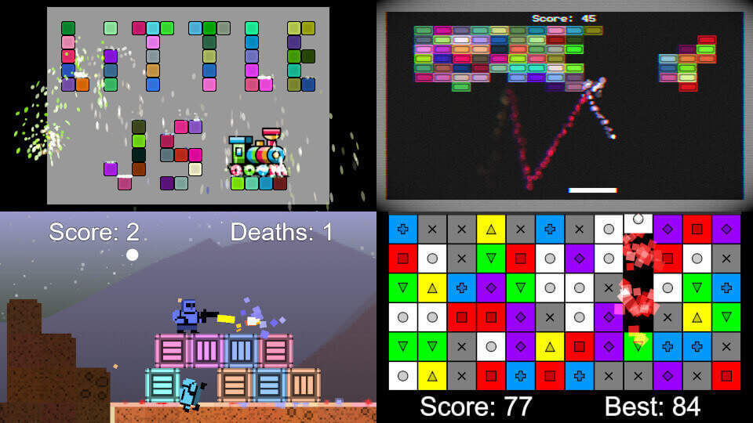

Credit: Frank Force and contributors

Rights expression: **MIT**. [rights evidence](https://github.com/KilledByAPixel/LittleJS/blob/da1b3836552b2373522a56bd39d6fb9f4b530017/LICENSE).

Allowed use: Independent narrow local research-display review passed for this exact audited image. The approval is limited to identifying the upstream project in the local HeadStart catalog; it does not authorize public redistribution, source export, promotional reuse, relicensing, game-asset reuse, endorsement, or imply that third-party assets are covered by the code license.

[Exact rights/provenance evidence](https://github.com/KilledByAPixel/LittleJS/blob/da1b3836552b2373522a56bd39d6fb9f4b530017/LICENSE) · [Original image](https://raw.githubusercontent.com/KilledByAPixel/LittleJS/da1b3836552b2373522a56bd39d6fb9f4b530017/examples/screenshot.jpg) · [Project reference](https://github.com/KilledByAPixel/LittleJS)

Capture date: unknown (unknown). Uploaded: unknown. Downloaded: 2026-09-10T21:01:01.661078+00:00.

Pinned repository example montage. This image identifies the named catalog record but is not a HeadStart playthrough, source/deployment parity check or integration attestation. Independent narrow local research-display review passed. This represents engine examples rather than one complete game.

Changes: Original bytes retained unchanged; browser display and contact sheet may scale without cropping.

SHA256: `7a1ddaa184b36fb75ee9d80bd0b10d47a1471b572779b0ad15c995de897012e5`. Dimensions: 960 × 540.

## 17. CityMaker

Credit: derek-wangpch and contributors

Rights expression: **MIT**. [rights evidence](https://opensource.org/license/mit).

Allowed use: Local HeadStart catalog identification and preview display for this repository-included image under the listed terms; no broader game-asset reuse, endorsement or model-quality claim.

[Exact rights/provenance evidence](https://github.com/derek-wangpch/OpenCityMaker/blob/ca45404de679baf5afb6b2504ef3c0af27b64ffc/LICENSE) · [Original image](https://raw.githubusercontent.com/derek-wangpch/OpenCityMaker/ca45404de679baf5afb6b2504ef3c0af27b64ffc/docs/images/citymaker-game.png) · [Project reference](https://github.com/derek-wangpch/OpenCityMaker)

Capture date: unknown (unknown). Uploaded: unknown. Downloaded: 2026-09-10T21:01:01.661078+00:00.

Image file pinned in the named repository at the indexed source commit; not a HeadStart playthrough or target-integration attestation. File-specific local display review only. The repository-level license is applied only where this selected image is included in that licensed tree and no narrower file notice was found. Underlying assets, dependencies, public publication and code extraction retain the record's separate rights limits.

Changes: Original bytes retained unchanged; browser display and contact sheet may scale without cropping.

SHA256: `d739b7560f9700730f4679d866fd1cf4c6af28921178444ceb1e8790b060f3bf`. Dimensions: 1440 × 1100.

## 18. Poimandres Racing Game

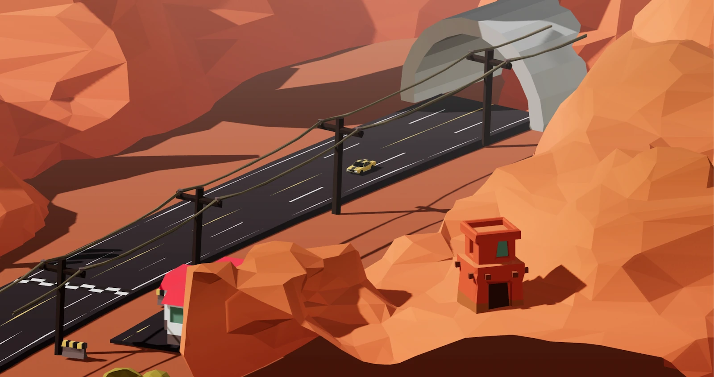

Credit: pmndrs and contributors

Rights expression: **MIT**. [rights evidence](https://opensource.org/license/mit).

Allowed use: Local HeadStart catalog identification and preview display for this repository-included image under the listed terms; no broader game-asset reuse, endorsement or model-quality claim.

[Exact rights/provenance evidence](https://github.com/pmndrs/racing-game/blob/7816a5d954b75e6ad853ae4e4f0cbbd628072643/LICENSE.md) · [Original image](https://raw.githubusercontent.com/pmndrs/racing-game/7816a5d954b75e6ad853ae4e4f0cbbd628072643/thumbnail.webp) · [Project reference](https://github.com/pmndrs/racing-game)

Capture date: unknown (unknown). Uploaded: unknown. Downloaded: 2026-09-10T21:01:01.661078+00:00.

Image file pinned in the named repository at the indexed source commit; not a HeadStart playthrough or target-integration attestation. File-specific local display review only. The repository-level license is applied only where this selected image is included in that licensed tree and no narrower file notice was found. Underlying assets, dependencies, public publication and code extraction retain the record's separate rights limits.

Changes: Original bytes retained unchanged; browser display and contact sheet may scale without cropping.

SHA256: `44088d796a27865624b38a86d89df8fb087b8360bf56a1ee8572892bc82cf44d`. Dimensions: 1600 × 845.

## 19. React Three Rapier

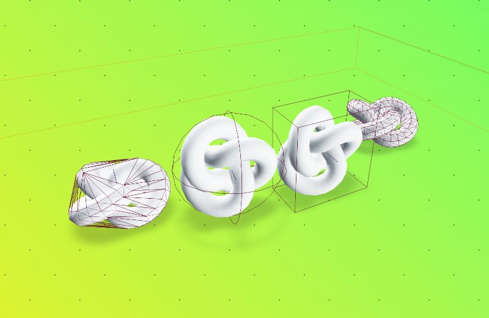

Credit: pmndrs and contributors

Rights expression: **MIT**. [rights evidence](https://github.com/pmndrs/react-three-rapier/blob/ae5c3fede5ca489fd7eaa8271e9d9c5eabc88e98/LICENSE).

Allowed use: Independent narrow local research-display review passed for this exact audited image. The approval is limited to identifying the upstream project in the local HeadStart catalog; it does not authorize public redistribution, source export, promotional reuse, relicensing, game-asset reuse, endorsement, or imply that third-party assets are covered by the code license.

[Exact rights/provenance evidence](https://github.com/pmndrs/react-three-rapier/blob/ae5c3fede5ca489fd7eaa8271e9d9c5eabc88e98/LICENSE) · [Original image](https://raw.githubusercontent.com/pmndrs/react-three-rapier/ae5c3fede5ca489fd7eaa8271e9d9c5eabc88e98/packages/react-three-rapier/misc/example-auto-colliders.jpg) · [Project reference](https://github.com/pmndrs/react-three-rapier)

Capture date: unknown (unknown). Uploaded: unknown. Downloaded: 2026-09-10T21:01:01.661078+00:00.

Pinned repository interactive physics example screenshot. This image identifies the named catalog record but is not a HeadStart playthrough, source/deployment parity check or integration attestation. Independent narrow local research-display review passed. Represents a reusable physics capability rather than a complete game.

Changes: Original bytes retained unchanged; browser display and contact sheet may scale without cropping.

SHA256: `645a6f73889291ee7974d308c317217b6fd283618e6cea0d975bd50d04f9ee91`. Dimensions: 800 × 520.

## 20. SlimCity

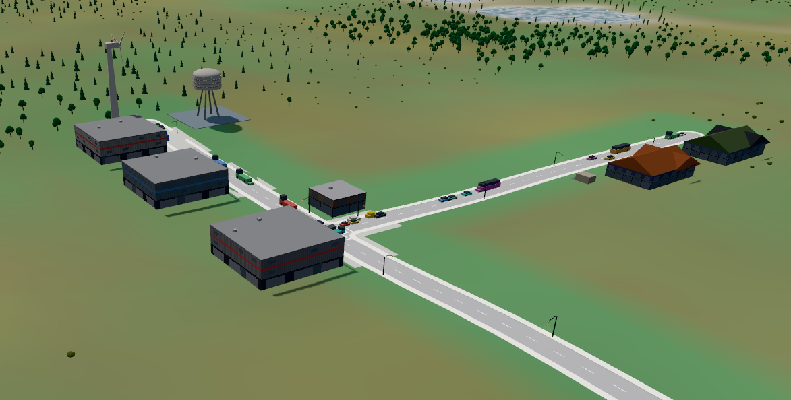

Credit: rbenzing and contributors

Rights expression: **AGPL-3.0-or-later**. [rights evidence](https://www.gnu.org/licenses/agpl-3.0.html).

Allowed use: Local HeadStart catalog identification and preview display for this repository-included image under the listed terms; no broader game-asset reuse, endorsement or model-quality claim.

[Exact rights/provenance evidence](https://github.com/rbenzing/SlimCityGame/blob/73e065226b8134cf44901a641076aeed3281f9f1/LICENSE) · [Original image](https://raw.githubusercontent.com/rbenzing/SlimCityGame/73e065226b8134cf44901a641076aeed3281f9f1/screenshots/screenshot-01.png) · [Project reference](https://github.com/rbenzing/SlimCityGame)

Capture date: unknown (unknown). Uploaded: unknown. Downloaded: 2026-09-10T21:01:01.661078+00:00.

Image file pinned in the named repository at the indexed source commit; not a HeadStart playthrough or target-integration attestation. File-specific local display review only. The repository-level license is applied only where this selected image is included in that licensed tree and no narrower file notice was found. Underlying assets, dependencies, public publication and code extraction retain the record's separate rights limits.

Changes: Original bytes retained unchanged; browser display and contact sheet may scale without cropping.

SHA256: `b39876bd5cead3537ffb97ba72df43521aaf3ae7c8d611abcafb0462ed2222f5`. Dimensions: 1173 × 594.

## 21. three-mesh-bvh

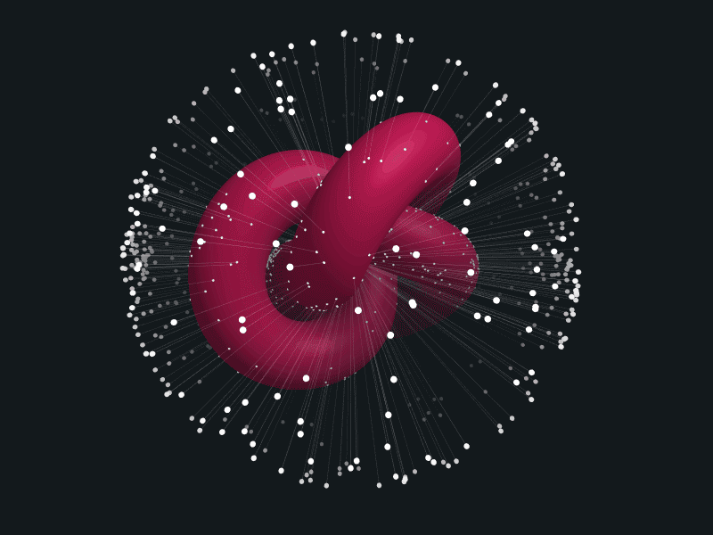

Credit: gkjohnson and contributors

Rights expression: **MIT**. [rights evidence](https://github.com/gkjohnson/three-mesh-bvh/blob/8747a3c418f1dafa7c3ab1b3c1ffdecc531a2eab/LICENSE).

Allowed use: Independent narrow local research-display review passed for this exact audited image. The approval is limited to identifying the upstream project in the local HeadStart catalog; it does not authorize public redistribution, source export, promotional reuse, relicensing, game-asset reuse, endorsement, or imply that third-party assets are covered by the code license.

[Exact rights/provenance evidence](https://github.com/gkjohnson/three-mesh-bvh/blob/8747a3c418f1dafa7c3ab1b3c1ffdecc531a2eab/LICENSE) · [Original image](https://raw.githubusercontent.com/gkjohnson/three-mesh-bvh/8747a3c418f1dafa7c3ab1b3c1ffdecc531a2eab/docs/example-sm.gif) · [Project reference](https://github.com/gkjohnson/three-mesh-bvh)

Capture date: unknown (unknown). Uploaded: unknown. Downloaded: 2026-09-10T21:01:01.661078+00:00.

Pinned repository interactive capability demo animation. This image identifies the named catalog record but is not a HeadStart playthrough, source/deployment parity check or integration attestation. Independent narrow local research-display review passed. Represents spatial-query/raycast capability rather than a complete game.

Changes: Original bytes retained unchanged; browser display and contact sheet may scale without cropping.

SHA256: `3ff289466734ad424adf17a5fddb2b1bce97ae144e104ab6083083efb496b381`. Dimensions: 800 × 600.

## 22. three-pathfinding

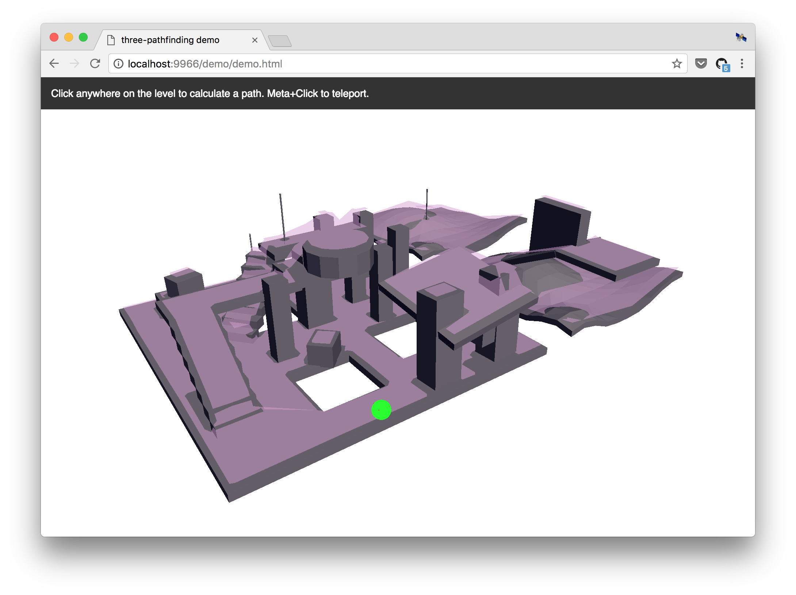

Credit: donmccurdy and contributors

Rights expression: **MIT**. [rights evidence](https://opensource.org/license/mit).

Allowed use: Local HeadStart catalog identification and preview display for this repository-included image under the listed terms; no broader game-asset reuse, endorsement or model-quality claim.

[Exact rights/provenance evidence](https://github.com/donmccurdy/three-pathfinding/blob/1526c84afed0d596cb13f4b7be36401fd2c6a430/LICENSE) · [Original image](https://user-images.githubusercontent.com/1848368/34424850-d79e5a24-ebf4-11e7-87c4-afc75cdc41bd.png) · [Project reference](https://github.com/donmccurdy/three-pathfinding)

Capture date: unknown (unknown). Uploaded: unknown. Downloaded: 2026-09-10T21:01:01.661078+00:00.

Image file pinned in the named repository at the indexed source commit; not a HeadStart playthrough or target-integration attestation. File-specific local display review only. The repository-level license is applied only where this selected image is included in that licensed tree and no narrower file notice was found. Underlying assets, dependencies, public publication and code extraction retain the record's separate rights limits.

Changes: Original bytes retained unchanged; browser display and contact sheet may scale without cropping.

SHA256: `91999166337568f4cf249957b1713334901a897338e7ecb8b2d4ae44fabe6548`. Dimensions: 2180 × 1632.

## 23. THREE.Terrain

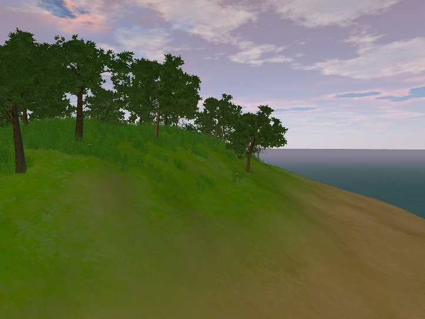

Credit: Isaac Sukin and contributors

Rights expression: **MIT**. [rights evidence](https://opensource.org/license/mit).

Allowed use: Local HeadStart catalog identification and preview display for this repository-included image under the listed terms; no broader game-asset reuse, endorsement or model-quality claim.

[Exact rights/provenance evidence](https://github.com/IceCreamYou/THREE.Terrain/blob/434d977ffdbac604cd5c6fd332c4d005f7f9ec68/LICENSE.txt) · [Original image](https://raw.githubusercontent.com/IceCreamYou/THREE.Terrain/434d977ffdbac604cd5c6fd332c4d005f7f9ec68/demo/img/screenshot2.jpg) · [Project reference](https://github.com/IceCreamYou/THREE.Terrain)

Capture date: unknown (unknown). Uploaded: unknown. Downloaded: 2026-09-10T21:01:01.661078+00:00.

Image file pinned in the named repository at the indexed source commit; not a HeadStart playthrough or target-integration attestation. File-specific local display review only. The repository-level license is applied only where this selected image is included in that licensed tree and no narrower file notice was found. Underlying assets, dependencies, public publication and code extraction retain the record's separate rights limits.

Changes: Original bytes retained unchanged; browser display and contact sheet may scale without cropping.

SHA256: `eec926ed43e62a9fee3bcbca89276235eff4c0fc6ad8f77f93fa0904bf1957ea`. Dimensions: 722 × 542.

## 24. Three.js

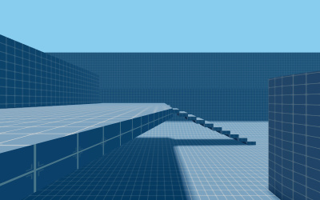

Credit: mrdoob and contributors

Rights expression: **MIT**. [rights evidence](https://github.com/mrdoob/three.js/blob/5c5a575bd8cc0cf440026ce8dcf6a77862067684/LICENSE).

Allowed use: Independent narrow local research-display review passed for this exact audited image. The approval is limited to identifying the upstream project in the local HeadStart catalog; it does not authorize public redistribution, source export, promotional reuse, relicensing, game-asset reuse, endorsement, or imply that third-party assets are covered by the code license.

[Exact rights/provenance evidence](https://github.com/mrdoob/three.js/blob/5c5a575bd8cc0cf440026ce8dcf6a77862067684/LICENSE) · [Original image](https://raw.githubusercontent.com/mrdoob/three.js/5c5a575bd8cc0cf440026ce8dcf6a77862067684/examples/screenshots/games_fps.jpg) · [Project reference](https://github.com/mrdoob/three.js)

Capture date: unknown (unknown). Uploaded: unknown. Downloaded: 2026-09-10T21:01:01.661078+00:00.

Pinned repository screenshot of the official FPS game example. This image identifies the named catalog record but is not a HeadStart playthrough, source/deployment parity check or integration attestation. Independent narrow local research-display review passed. Represents one official engine example, not the entire Three.js project.

Changes: Original bytes retained unchanged; browser display and contact sheet may scale without cropping.

SHA256: `a2319a4d4874518beea8dedbe9aa7ffe2dbc0673b1a1db1598c01369ad0b6f85`. Dimensions: 400 × 250.

## 25. Vesper Street

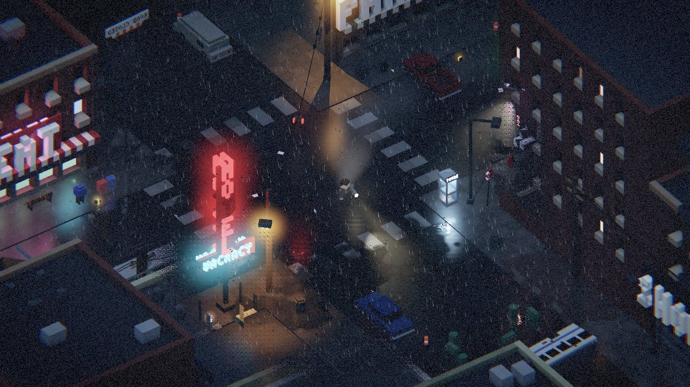

Credit: winchxyz and contributors

Rights expression: **MIT**. [rights evidence](https://opensource.org/license/mit).

Allowed use: Local HeadStart catalog identification and preview display for this repository-included image under the listed terms; no broader game-asset reuse, endorsement or model-quality claim.

[Exact rights/provenance evidence](https://github.com/winchxyz/vesper-street/blob/fcc2f6eda84311194c0834de6cd7081c2965086f/LICENSE) · [Original image](https://raw.githubusercontent.com/winchxyz/vesper-street/fcc2f6eda84311194c0834de6cd7081c2965086f/media/01_vesper_street.jpg) · [Project reference](https://github.com/winchxyz/vesper-street)

Capture date: unknown (unknown). Uploaded: unknown. Downloaded: 2026-09-10T21:01:01.661078+00:00.

Image file pinned in the named repository at the indexed source commit; not a HeadStart playthrough or target-integration attestation. File-specific local display review only. The repository-level license is applied only where this selected image is included in that licensed tree and no narrower file notice was found. Underlying assets, dependencies, public publication and code extraction retain the record's separate rights limits.

Changes: Original bytes retained unchanged; browser display and contact sheet may scale without cropping.

SHA256: `c104e95e6989e75da77ff5ced1eecc6cc5927f06f54e06a69b3737721e6e9af6`. Dimensions: 1280 × 720.

## 26. Little Flock

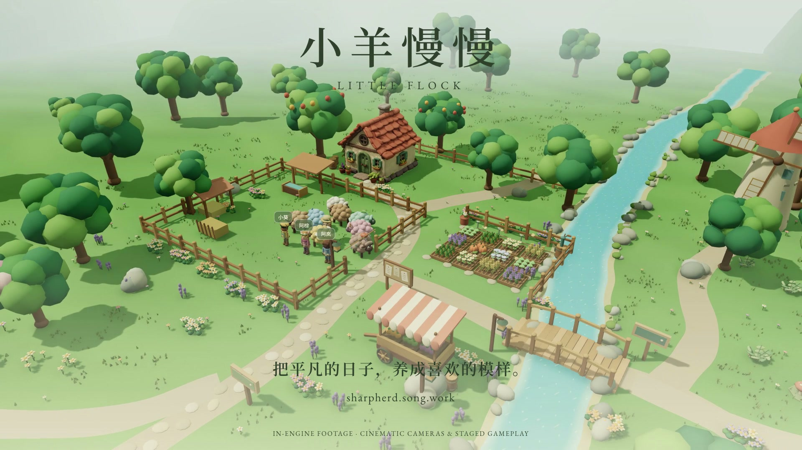

Credit: songkeys and Little Flock contributors

Rights expression: **CC-BY-4.0**. [rights evidence](https://creativecommons.org/licenses/by/4.0/).

Allowed use: HeadStart catalog identification and preview display for this exact image with listed credit and terms; no endorsement, model-quality claim or blanket game-asset clearance.

[Exact rights/provenance evidence](https://github.com/songkeys/little-flock/blob/eaaa56184ad8f1b513ae81960075846663803886/ASSETS.md) · [Original image](https://raw.githubusercontent.com/songkeys/little-flock/eaaa56184ad8f1b513ae81960075846663803886/docs/demo-poster.jpg) · [Project reference](https://github.com/songkeys/little-flock)

Capture date: unknown (unknown). Uploaded: unknown. Downloaded: 2026-09-11T01:35:00Z.

Pinned repository image at the indexed source commit. Repository gameplay-demo poster, described as in-engine staged gameplay. UI is currently Simplified Chinese.

Changes: Original repository bytes retained unchanged; site CSS may scale and crop.

SHA256: `8a2a768ccc8467c5cd5cfe7d90764fa58d30010ef34a286ae2eef0a36b9ba8cf`. Dimensions: 1920 × 1080.

## 27. P(DOOM): The Alignment Problem

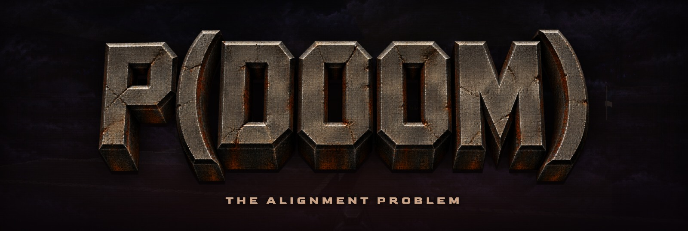

Credit: Travis Fischer and contributors

Rights expression: **MIT AND LicenseRef-PDOOM-Notices**. [rights evidence](https://opensource.org/license/mit).

Allowed use: HeadStart catalog identification and preview display for this exact image with listed credit and terms; no endorsement, model-quality claim or blanket game-asset clearance.

[Exact rights/provenance evidence](https://github.com/transitive-bullshit/ai-safety-doom/blob/5b7f433d9df121ba9c9a4d998a668954278f0b76/NOTICES.md) · [Original image](https://raw.githubusercontent.com/transitive-bullshit/ai-safety-doom/5b7f433d9df121ba9c9a4d998a668954278f0b76/docs/images/arrival.jpg) · [Project reference](https://github.com/transitive-bullshit/ai-safety-doom)

Capture date: unknown (unknown). Uploaded: unknown. Downloaded: 2026-09-11T01:35:00Z.

Pinned repository image at the indexed source commit. Authentic in-game Arrival Platform combat frame from the pinned upstream repository.

Changes: Original repository bytes retained unchanged; site CSS may scale and crop.

SHA256: `25b3ddd858038a5bae291cb14208df396c0df95c063b695a0a342dddb5a8a8a2`. Dimensions: 1440 × 1000.

## 28. Apex Formula

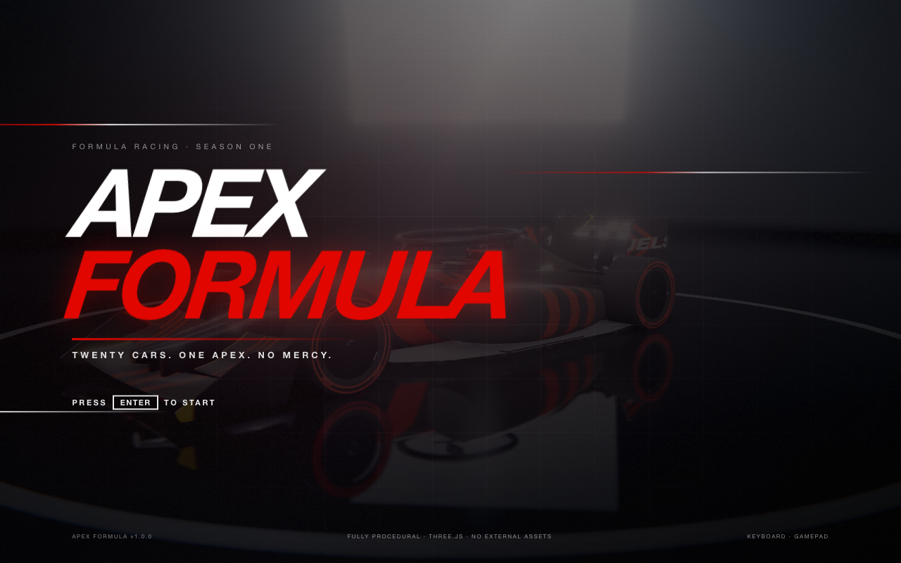

Credit: BridgeMind; screenshot captured by HeadStart

Rights expression: **MIT**. [rights evidence](https://opensource.org/license/mit).

Allowed use: HeadStart catalog identification and preview display for this exact image with listed credit and terms; no endorsement, model-quality claim or blanket game-asset clearance.

[Exact rights/provenance evidence](https://github.com/bridge-mind/apex-formula/blob/e5292b85c9a8773fd2a5e2b55df570d5da963488/LICENSE) · [Original image](https://bridge-mind.github.io/apex-formula/) · [Project reference](https://github.com/bridge-mind/apex-formula)

Capture date: 2026-09-11 (source_declared). Uploaded: unknown. Downloaded: 2026-09-11T01:35:00Z.

Live deployment capture; deployed source revision is not attested. Authentic live game capture at 1280x800 on 2026-09-11 using headless Chrome and software WebGL; exact deployed commit not attested.

Changes: Captured at 1280x800; otherwise unchanged.

SHA256: `b89f79ad676efa1176f57364f4dcb37c3d44e7554a9a587b3a0aa60ab0b04993`. Dimensions: 1280 × 800.

## 29. Turbo Kart Rush

Credit: BridgeMind

Rights expression: **MIT**. [rights evidence](https://opensource.org/license/mit).

Allowed use: HeadStart catalog identification and preview display for this exact image with listed credit and terms; no endorsement, model-quality claim or blanket game-asset clearance.

[Exact rights/provenance evidence](https://github.com/bridge-mind/turbo-kart-rush/blob/6c0456c7642447eae29e0832e7e542fec07ec07d/LICENSE) · [Original image](https://raw.githubusercontent.com/bridge-mind/turbo-kart-rush/6c0456c7642447eae29e0832e7e542fec07ec07d/docs/screenshots/race.jpg) · [Project reference](https://github.com/bridge-mind/turbo-kart-rush)

Capture date: unknown (unknown). Uploaded: unknown. Downloaded: 2026-09-11T01:35:00Z.

Pinned repository image at the indexed source commit. Pinned repository gameplay screenshot.

Changes: Original repository bytes retained unchanged; site CSS may scale and crop.

SHA256: `e9015659e69d8b5664509c6312660cf714c5a6b5453345169b117dadd895b578`. Dimensions: 1280 × 720.

## 30. Berlin Walk

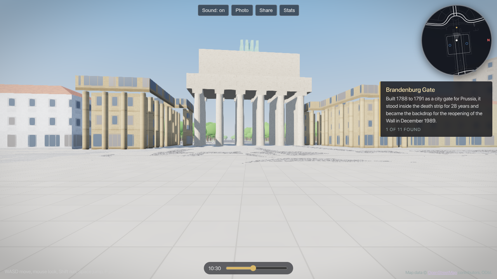

Credit: Adilzhan; OpenStreetMap contributors

Rights expression: **MIT AND ODbL-1.0**. [rights evidence](https://opensource.org/license/mit), [rights evidence](https://www.openstreetmap.org/copyright).

Allowed use: HeadStart catalog identification and preview display for this exact image with listed credit and terms; no endorsement, model-quality claim or blanket game-asset clearance.

[Exact rights/provenance evidence](https://github.com/adilzhanY/berlin-walk/blob/8afa9c84d80c6b476de23d8239c2c9b4b1770003/README.md) · [Original image](https://raw.githubusercontent.com/adilzhanY/berlin-walk/8afa9c84d80c6b476de23d8239c2c9b4b1770003/docs/screenshots/01_spawn_pariser_platz.png) · [Project reference](https://github.com/adilzhanY/berlin-walk)

Capture date: unknown (unknown). Uploaded: unknown. Downloaded: 2026-09-11T01:35:00Z.

Pinned repository image at the indexed source commit. Pinned repository gameplay screenshot; OSM attribution applies.

Changes: Original repository bytes retained unchanged; site CSS may scale and crop.

SHA256: `bb5fa2179c7552e8e756e73b3067468d56e7817ff3238a6b79017c5b521afbf5`. Dimensions: 1280 × 720.

## 31. SkySprout

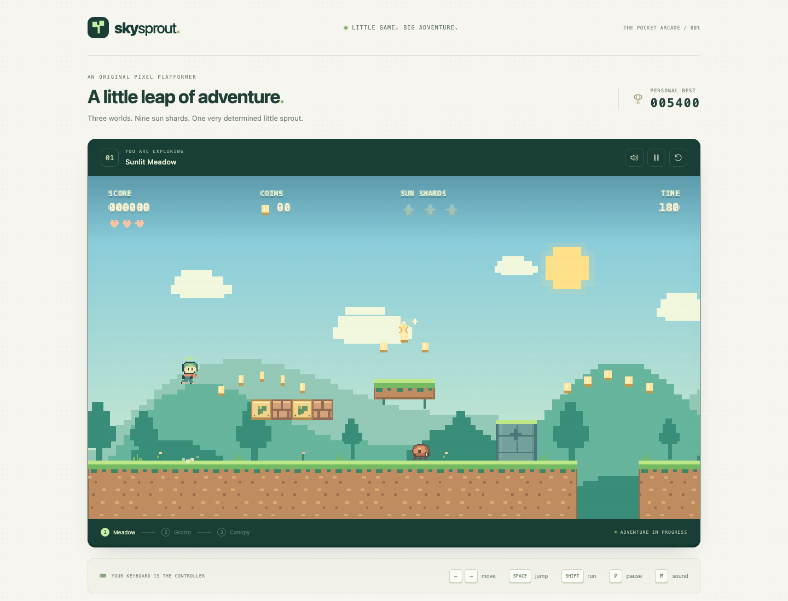

Credit: DUBSOpenHub contributors

Rights expression: **MIT**. [rights evidence](https://opensource.org/license/mit).

Allowed use: HeadStart catalog identification and preview display for this exact image with listed credit and terms; no endorsement, model-quality claim or blanket game-asset clearance.

[Exact rights/provenance evidence](https://github.com/DUBSOpenHub/skysprout/blob/8c0484fc4243cc98507173d4b49a5658ff8b960f/LICENSE) · [Original image](https://raw.githubusercontent.com/DUBSOpenHub/skysprout/8c0484fc4243cc98507173d4b49a5658ff8b960f/docs/images/skysprout-meadow.png) · [Project reference](https://github.com/DUBSOpenHub/skysprout)

Capture date: unknown (unknown). Uploaded: unknown. Downloaded: 2026-09-11T01:35:00Z.

Pinned repository image at the indexed source commit. Pinned repository gameplay screenshot; README explicitly identifies it as playable gameplay.

Changes: Original repository bytes retained unchanged; site CSS may scale and crop.

SHA256: `66680a39cdf7bc0d11de4e24a7820b7acbea70f67734624cab3cae01ee74d49c`. Dimensions: 1440 × 1100.

## 32. Glenn Explore

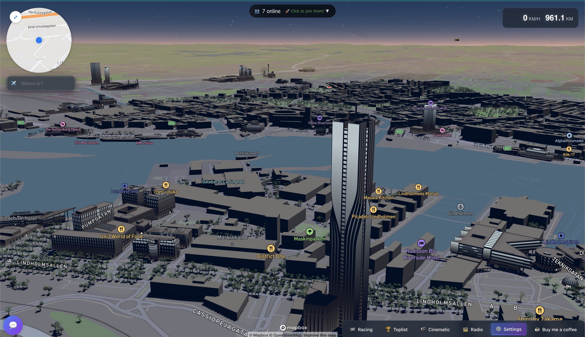

Credit: William Av Holmberg and contributors

Rights expression: **GPL-3.0-only**. [rights evidence](https://www.gnu.org/licenses/gpl-3.0.html).

Allowed use: HeadStart catalog identification and preview display for this exact image with listed credit and terms; no endorsement, model-quality claim or blanket game-asset clearance.

[Exact rights/provenance evidence](https://github.com/WilliamAvHolmberg/glenn-explore/blob/5b40306259dcaa2fc7a0fbb32626f50c3bc99805/LICENSE) · [Original image](https://raw.githubusercontent.com/WilliamAvHolmberg/glenn-explore/5b40306259dcaa2fc7a0fbb32626f50c3bc99805/web/public/hero.jpg) · [Project reference](https://github.com/WilliamAvHolmberg/glenn-explore)

Capture date: unknown (unknown). Uploaded: unknown. Downloaded: 2026-09-11T01:35:00Z.

Pinned repository image at the indexed source commit. Pinned repository game hero image.

Changes: Original repository bytes retained unchanged; site CSS may scale and crop.

SHA256: `08b8be2b5db87637fd47f38f8bbbddd7158cc97da774f650359cc1e40c328826`. Dimensions: 3600 × 2076.

## 33. NeoMud

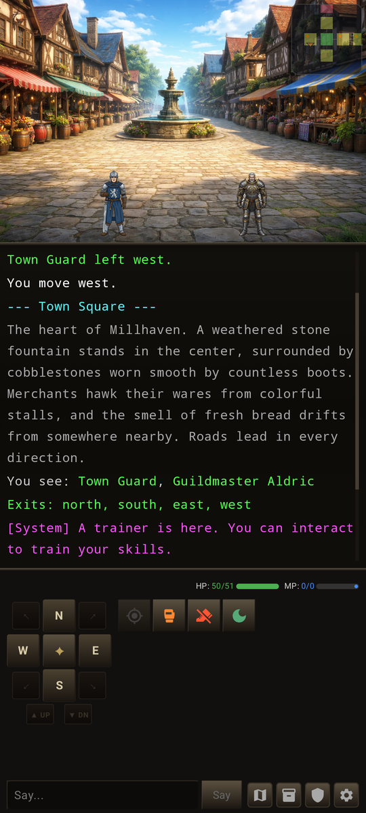

Credit: Roomsmith Games contributors

Rights expression: **MIT**. [rights evidence](https://opensource.org/license/mit).

Allowed use: HeadStart catalog identification and preview display for this exact image with listed credit and terms; no endorsement, model-quality claim or blanket game-asset clearance.

[Exact rights/provenance evidence](https://github.com/roomsmith-games/NeoMud/blob/b6f1b31c230c01d83f84feba0a6f5e9d6e061a7a/LICENSE) · [Original image](https://raw.githubusercontent.com/roomsmith-games/NeoMud/b6f1b31c230c01d83f84feba0a6f5e9d6e061a7a/docs/screenshots/town_square.png) · [Project reference](https://github.com/roomsmith-games/NeoMud)

Capture date: unknown (unknown). Uploaded: unknown. Downloaded: 2026-09-11T01:35:00Z.

Pinned repository image at the indexed source commit. Pinned repository live-game screenshot.

Changes: Original repository bytes retained unchanged; site CSS may scale and crop.

SHA256: `72e5bfb7521811e02a3cf9ffa7730a466291dab081446f632900e7a8340b1fb6`. Dimensions: 540 × 1200.

## 34. Server Survival gameplay

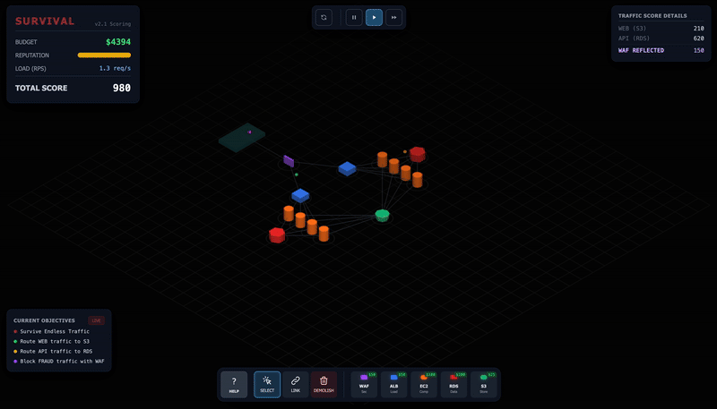

Credit: pshenok

Rights expression: **MIT repository; screenshot/content rights need scope review**. [rights evidence](https://github.com/pshenok/server-survival/blob/01796362d3b7bfa6c85efab5e2685f4d955dc137/LICENSE).

Allowed use: Local catalog display with credit and source link; no downstream asset-reuse conclusion.

[Exact rights/provenance evidence](https://github.com/pshenok/server-survival/blob/01796362d3b7bfa6c85efab5e2685f4d955dc137/LICENSE) · [Original image](https://raw.githubusercontent.com/pshenok/server-survival/01796362d3b7bfa6c85efab5e2685f4d955dc137/assets/gameplay.gif) · [Project reference](https://github.com/pshenok/server-survival)

Capture date: 2026-09-11 (unknown). Uploaded: 2026-09-11T02:10:00Z. Downloaded: 2026-09-11T02:10:00Z.

Stored at the pinned inspected source revision. Authentic gameplay media from the pinned upstream repository.

Changes: Unmodified upstream bytes.

SHA256: `436a1c94a79b7e4c03077fc279fbe02efd665203c7c80076866709f98b597401`. Dimensions: 800 × 457.

## 35. Regolith: The Silence at Anaxagoras gameplay

Credit: winchxyz

Rights expression: **MIT repository; screenshot/content rights need scope review**. [rights evidence](https://github.com/winchxyz/moon-rover/blob/f5f25ba6bf7477c612b408b265c9275a4fd1200d/LICENSE).

Allowed use: Local catalog display with credit and source link; no downstream asset-reuse conclusion.

[Exact rights/provenance evidence](https://github.com/winchxyz/moon-rover/blob/f5f25ba6bf7477c612b408b265c9275a4fd1200d/LICENSE) · [Original image](https://raw.githubusercontent.com/winchxyz/moon-rover/f5f25ba6bf7477c612b408b265c9275a4fd1200d/docs/hero.jpg) · [Project reference](https://github.com/winchxyz/moon-rover)

Capture date: 2026-09-11 (unknown). Uploaded: 2026-09-11T02:10:00Z. Downloaded: 2026-09-11T02:10:00Z.

Stored at the pinned inspected source revision. Authentic gameplay media from the pinned upstream repository.

Changes: Unmodified upstream bytes.

SHA256: `9307b7524a3bc6ca3522944e022149629644368175dec4b27321bc43e1d3cc5c`. Dimensions: 1600 × 800.

## 36. Operation Ironhold gameplay

Credit: StarKnightt

Rights expression: **MIT repository; screenshot/content rights need scope review**. [rights evidence](https://github.com/StarKnightt/operation-ironhold/blob/58b292758fd29953c35bcd3ee7113004b709fda3/LICENSE).

Allowed use: Local catalog display with credit and source link; no downstream asset-reuse conclusion.

[Exact rights/provenance evidence](https://github.com/StarKnightt/operation-ironhold/blob/58b292758fd29953c35bcd3ee7113004b709fda3/LICENSE) · [Original image](https://raw.githubusercontent.com/StarKnightt/operation-ironhold/58b292758fd29953c35bcd3ee7113004b709fda3/screenshots/gameplay.jpg) · [Project reference](https://github.com/StarKnightt/operation-ironhold)

Capture date: 2026-09-11 (unknown). Uploaded: 2026-09-11T02:10:00Z. Downloaded: 2026-09-11T02:10:00Z.

Stored at the pinned inspected source revision. Authentic gameplay media from the pinned upstream repository.

Changes: Unmodified upstream bytes.

SHA256: `1aef0e21fdadf34c5a784e0b4fa13c6cb9450aa4519b2984e71778fac5748f52`. Dimensions: 1414 × 795.

## 37. Emerald Bayou gameplay

Credit: Vheissu

Rights expression: **MIT repository; media rights need scope review**. [rights evidence](https://github.com/Vheissu/emerald-bayou/blob/e87c03688263daadb1bfbf35efaddc5ab7d53912/LICENSE).

Allowed use: Local catalog display with credit and source link.

[Exact rights/provenance evidence](https://github.com/Vheissu/emerald-bayou/blob/e87c03688263daadb1bfbf35efaddc5ab7d53912/LICENSE) · [Original image](https://raw.githubusercontent.com/Vheissu/emerald-bayou/e87c03688263daadb1bfbf35efaddc5ab7d53912/docs/screenshots/01-hero.jpg) · [Project reference](https://github.com/Vheissu/emerald-bayou)

Capture date: 2026-09-11 (unknown). Uploaded: 2026-09-11T02:30:00Z. Downloaded: 2026-09-11T02:30:00Z.

Stored at pinned revision. Authentic gameplay media from pinned upstream.

Changes: Unmodified upstream bytes.

SHA256: `64a67d0f40f04c99f9626ef8a2da2a05c11b87c47f81feee952c87db10cc1bf7`. Dimensions: 1568 × 720.

## 38. Cadle gameplay

Credit: Humpalumps

Rights expression: **MIT repository; media rights need scope review**. [rights evidence](https://github.com/Humpalumps/Cadle/blob/ea0da62549980816a6a27e08b75808b1f56d70e7/LICENSE).

Allowed use: Local catalog display with credit and source link.

[Exact rights/provenance evidence](https://github.com/Humpalumps/Cadle/blob/ea0da62549980816a6a27e08b75808b1f56d70e7/LICENSE) · [Original image](https://raw.githubusercontent.com/Humpalumps/Cadle/ea0da62549980816a6a27e08b75808b1f56d70e7/public/assets/site/vale-b.jpg) · [Project reference](https://github.com/Humpalumps/Cadle)

Capture date: 2026-09-11 (unknown). Uploaded: 2026-09-11T02:30:00Z. Downloaded: 2026-09-11T02:30:00Z.

Stored at pinned revision. Authentic gameplay media from pinned upstream.

Changes: Unmodified upstream bytes.

SHA256: `82d815a38d05c57831ecaa86409462dae7b928724db45d9c9519db4707905441`. Dimensions: 1280 × 720.

## 39. Jungle Trail gameplay

Credit: StarKnightt

Rights expression: **MIT repository; media rights need scope review**. [rights evidence](https://github.com/StarKnightt/jungle-trail/blob/c15640d3a2b6f08ca68e4df98fdfc953ea8a070a/LICENSE).

Allowed use: Local catalog display with credit and source link.

[Exact rights/provenance evidence](https://github.com/StarKnightt/jungle-trail/blob/c15640d3a2b6f08ca68e4df98fdfc953ea8a070a/LICENSE) · [Original image](https://raw.githubusercontent.com/StarKnightt/jungle-trail/c15640d3a2b6f08ca68e4df98fdfc953ea8a070a/media/reel.webp) · [Project reference](https://github.com/StarKnightt/jungle-trail)

Capture date: 2026-09-11 (unknown). Uploaded: 2026-09-11T02:30:00Z. Downloaded: 2026-09-11T02:30:00Z.

Stored at pinned revision. Authentic gameplay media from pinned upstream.

Changes: Unmodified upstream bytes.

SHA256: `ba7a2096b4d5aebd58fc832c4c4bf76455c8a0abae579d7f8126c094573e24ab`. Dimensions: 840 × 472.

## 40. Datacenter Survival gameplay

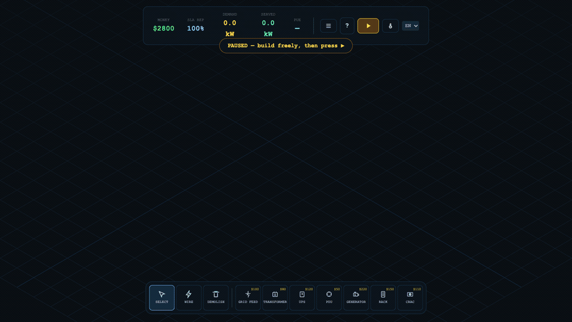

Credit: pshenok

Rights expression: **MIT repository; media rights need scope review**. [rights evidence](https://github.com/pshenok/datacenter-survival/blob/234588545ca6a1d63da41a0ec19a267e8623a72e/LICENSE).

Allowed use: Local catalog display with credit and source link.

[Exact rights/provenance evidence](https://github.com/pshenok/datacenter-survival/blob/234588545ca6a1d63da41a0ec19a267e8623a72e/LICENSE) · [Original image](https://raw.githubusercontent.com/pshenok/datacenter-survival/234588545ca6a1d63da41a0ec19a267e8623a72e/assets/demo.gif) · [Project reference](https://github.com/pshenok/datacenter-survival)

Capture date: 2026-09-11 (unknown). Uploaded: 2026-09-11T02:30:00Z. Downloaded: 2026-09-11T02:30:00Z.

Stored at pinned revision. Authentic gameplay media from pinned upstream.

Changes: Unmodified upstream bytes.

SHA256: `c720bed468ec52b4e0b4d4b83fac412dcd0d3dc140e9ef56e5237ccb1ad1ef6c`. Dimensions: 960 × 540.

## 41. Protocol 99: Entry 001 gameplay

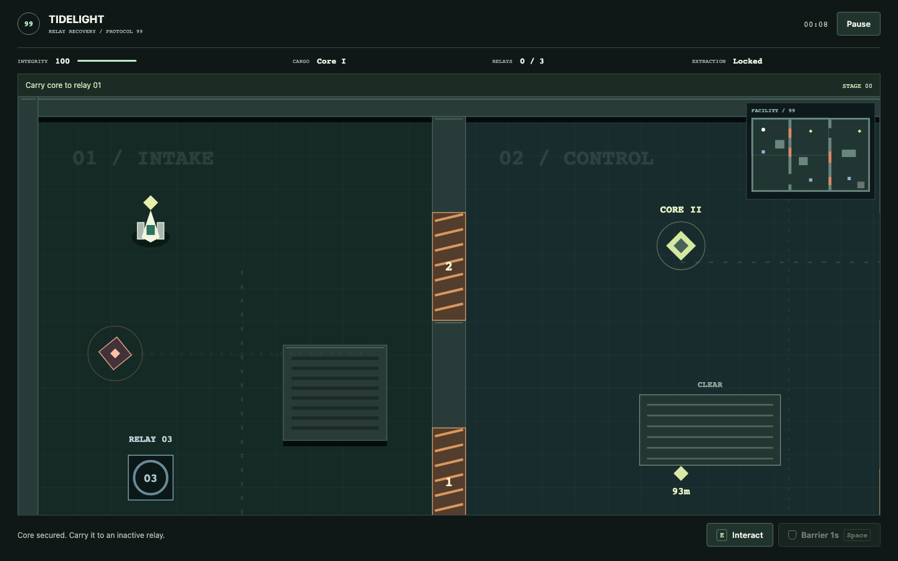

Credit: aidong27

Rights expression: **MIT repository; media rights need scope review**. [rights evidence](https://github.com/aidong27/99-ai-games/blob/6db39254d260d8e1627788c5ea6398449d3a4b0b/LICENSE).

Allowed use: Local catalog display with credit and source link.

[Exact rights/provenance evidence](https://github.com/aidong27/99-ai-games/blob/6db39254d260d8e1627788c5ea6398449d3a4b0b/LICENSE) · [Original image](https://raw.githubusercontent.com/aidong27/99-ai-games/6db39254d260d8e1627788c5ea6398449d3a4b0b/entries/001-openai-gpt-6-user-declared-codex/runs/run-raw-20260904-194605-codex/evidence/screenshots/gameplay.png) · [Project reference](https://github.com/aidong27/99-ai-games)

Capture date: 2026-09-11 (unknown). Uploaded: 2026-09-11T02:30:00Z. Downloaded: 2026-09-11T02:30:00Z.

Stored at pinned revision. Authentic gameplay media from pinned upstream.

Changes: Unmodified upstream bytes.

SHA256: `7336a2ce2443006bffe42311058568df8173cfa011105ef4f7fb101609002972`. Dimensions: 1440 × 900.
