# Image credits and scoped display evidence

These are authentic historical images with file-specific license evidence. They are not screenshots of the indexed commits or evidence that we played the games. Originals are retained byte-for-byte. The contact sheet scales copies to fit; it does not crop or alter game content. Each constituent image retains its own license; there is no blanket license for third-party imagery.

Retain this file, the media manifest, license notices, original images and linked source evidence when distributing the preview bundle. GPL-covered originals and their available game/source references are linked below; follow the listed license obligations for any further redistribution or adaptation. The metadata snapshot records the file-page assertions inspected during research, not a warranty of ownership.

## 01. SuperTux

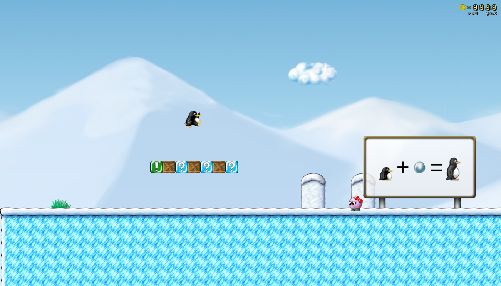

Credit: SuperTux Development Team; screenshot by Brmbrmcar (original upload log).

License: **GPL-2.0-or-later**. [license](https://www.gnu.org/licenses/old-licenses/gpl-2.0.html).

[Exact file-page evidence](https://commons.wikimedia.org/w/index.php?title=File%3ASuperTux+0.4.0+1st+level.png&oldid=1104799162) · [Original image](https://upload.wikimedia.org/wikipedia/commons/c/cf/SuperTux_0.4.0_1st_level.png) · [Game source](https://github.com/SuperTux/supertux)

Capture date: 2016-06-05 (source_declared). Uploaded: 2016-06-05T18:53:13Z. Downloaded: 2026-09-10T17:32:37.260932+00:00.

Historical image; relation to indexed source commit is unknown. Not a current build or play attestation. Scope review concerns this exact image only, not all game assets or source extraction.

Changes: Original image bytes retained unchanged; contact sheet scales an independent copy to fit, without content edits.

SHA256: `fec9ee287725f1252dea83d1d432188e8be2354973f97b00bbfd473300113835`. Dimensions: 1301 × 744.

## 02. SuperTuxKart

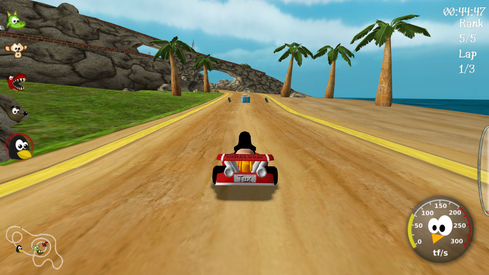

Credit: SuperTuxKart development team

License: **GPL-3.0-or-later AND CC-BY-SA-3.0**. [license](https://www.gnu.org/licenses/gpl-3.0.html), [license](https://creativecommons.org/licenses/by-sa/3.0/).

[Exact file-page evidence](https://commons.wikimedia.org/w/index.php?title=File%3ASuperTuxKart+0.8+screenshot.jpg&oldid=1210223221) · [Original image](https://upload.wikimedia.org/wikipedia/commons/4/4d/SuperTuxKart_0.8_screenshot.jpg) · [Game source](https://github.com/supertuxkart/stk-code)

Capture date: unknown (unknown). Uploaded: 2013-02-10T01:18:31Z. Downloaded: 2026-09-10T17:32:37.260932+00:00.

Historical image; relation to indexed source commit is unknown. Not a current build or play attestation. Scope review concerns this exact image only, not all game assets or source extraction. File page separately applies GPLv3+ to game imagery and CC BY-SA 3.0 to screenshot originality; retain both.

Changes: Original image bytes retained unchanged; contact sheet scales an independent copy to fit, without content edits.

SHA256: `2ee7f00a82c0770e0f12427022676f9bd9c00fd841583bd30389c9a50fdfe2a5`. Dimensions: 1280 × 720.

## 03. OpenTTD

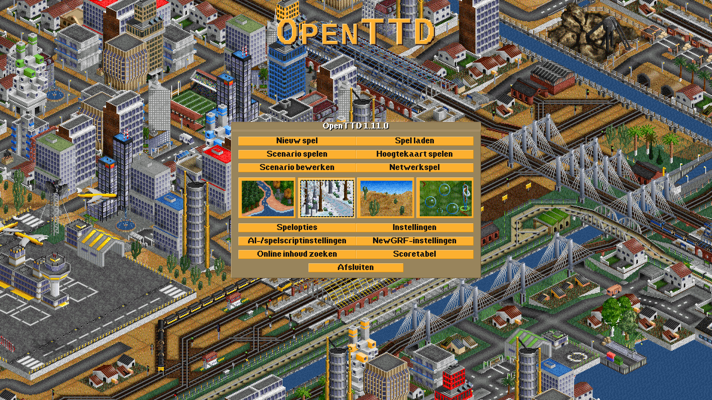

Credit: OpenTTD developers; OpenGFX contributors; screenshot uploaded by WoelfiVW. https://github.com/OpenTTD/OpenGFX/blob/master/README.md#60-credits https://www.openttd.org/about.html

License: **GPL-2.0-only**. [license](https://www.gnu.org/licenses/old-licenses/gpl-2.0.html).

[Exact file-page evidence](https://commons.wikimedia.org/w/index.php?title=File%3AOpenTTD-1.11.0-nl.png&oldid=879978866) · [Original image](https://upload.wikimedia.org/wikipedia/commons/0/0d/OpenTTD-1.11.0-nl.png) · [Game source](https://github.com/OpenTTD/OpenTTD)

Capture date: 2021-04-02 (source_declared). Uploaded: 2021-04-02T11:48:59Z. Downloaded: 2026-09-10T17:32:37.260932+00:00.

Historical image; relation to indexed source commit is unknown. Not a current build or play attestation. Scope review concerns this exact image only, not all game assets or source extraction. Commons structured data and visible template differ; this bundle follows the more restrictive visible GPLv2-only template and retains the complete source reference.

Changes: Original image bytes retained unchanged; contact sheet scales an independent copy to fit, without content edits.

SHA256: `bb32576edc6aa854d7cbb33b00623048b92b439b10ec3c3f17d3f03c471c0d89`. Dimensions: 1920 × 1080.

## 04. 0 A.D.

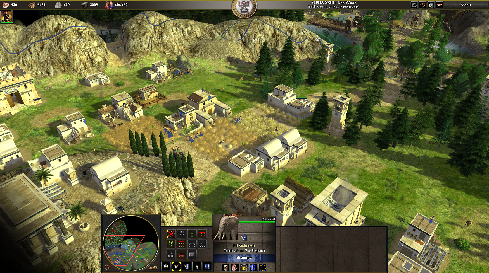

Credit: 0 A.D. Developers

License: **CC-BY-SA-3.0**. [license](https://creativecommons.org/licenses/by-sa/3.0/).

[Exact file-page evidence](https://commons.wikimedia.org/w/index.php?title=File%3A0+A.D.+Alpha+23.jpg&oldid=740095193) · [Original image](https://upload.wikimedia.org/wikipedia/commons/3/35/0_A.D._Alpha_23.jpg) · [Game source](https://gitea.wildfiregames.com/0ad/0ad)

Capture date: 2019-01-26 (source_declared). Uploaded: 2019-01-26T16:03:57Z. Downloaded: 2026-09-10T17:32:37.260932+00:00.

Historical image; relation to indexed source commit is unknown. Not a current build or play attestation. Scope review concerns this exact image only, not all game assets or source extraction.

Changes: Original image bytes retained unchanged; contact sheet scales an independent copy to fit, without content edits.

SHA256: `28ecba4c269eed07e8c848dac198947c6ac30744ec8f5fdb2e1d8563e9b3a842`. Dimensions: 1750 × 979.

## 05. Luanti / Minetest

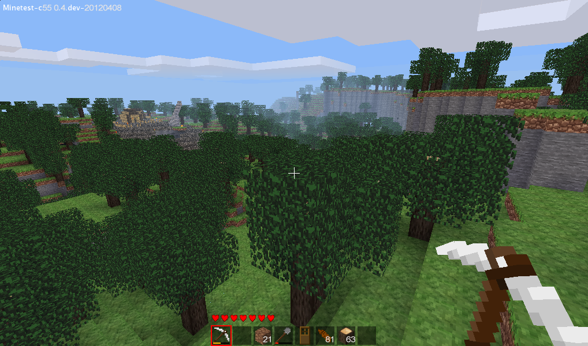

Credit: Perttu "celeron55" Ahola, Vanessa Ezekowitz, et.al

License: **CC-BY-SA-3.0**. [license](https://creativecommons.org/licenses/by-sa/3.0/).

[Exact file-page evidence](https://commons.wikimedia.org/w/index.php?title=File%3AMinetest+screenshot.png&oldid=1177730923) · [Original image](https://upload.wikimedia.org/wikipedia/commons/6/62/Minetest_screenshot.png) · [Game source](https://github.com/luanti-org/luanti)

Capture date: 2012-09-08 16:39:08 (source_declared). Uploaded: 2012-09-08T20:40:36Z. Downloaded: 2026-09-10T17:32:37.260932+00:00.

Historical image; relation to indexed source commit is unknown. Not a current build or play attestation. Scope review concerns this exact image only, not all game assets or source extraction.

Changes: Original image bytes retained unchanged; contact sheet scales an independent copy to fit, without content edits.

SHA256: `4219503502360f80c8e75186aa7e250894a99a87487f87d5edec4a48b722ecb3`. Dimensions: 1018 × 600.

## 06. Widelands

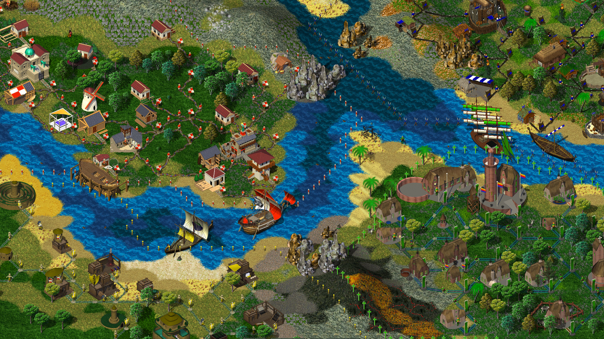

Credit: Widelands Development Team

License: **GPL-2.0-or-later**. [license](https://www.gnu.org/licenses/old-licenses/gpl-2.0.html).

[Exact file-page evidence](https://commons.wikimedia.org/w/index.php?title=File%3AFour+tribes+in+Widelands+Build+20.jpg&oldid=1166155186) · [Original image](https://upload.wikimedia.org/wikipedia/commons/5/5f/Four_tribes_in_Widelands_Build_20.jpg) · [Game source](https://github.com/widelands/widelands)

Capture date: 2019-01-03 (source_declared). Uploaded: 2019-05-13T20:13:28Z. Downloaded: 2026-09-10T17:32:37.260932+00:00.

Historical image; relation to indexed source commit is unknown. Not a current build or play attestation. Scope review concerns this exact image only, not all game assets or source extraction.

Changes: Original image bytes retained unchanged; contact sheet scales an independent copy to fit, without content edits.

SHA256: `93d2af2a0de094a264f341787fadff46af61f5369b67ad3d380de5669ccbe10f`. Dimensions: 1821 × 1025.

## 07. Battle for Wesnoth

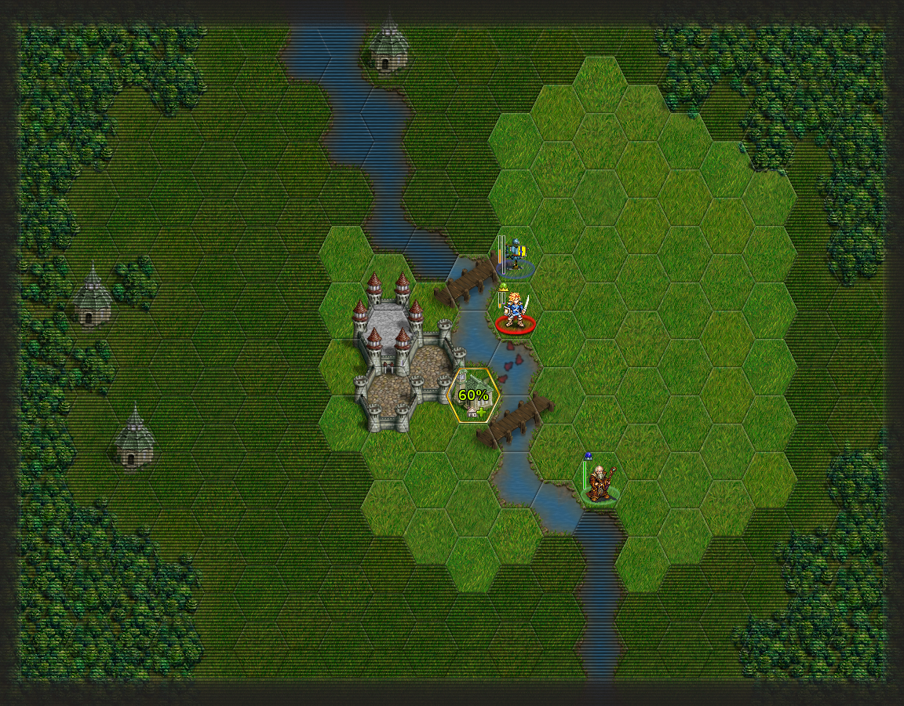

Credit: Mirgov

License: **GPL-2.0-or-later**. [license](https://www.gnu.org/licenses/old-licenses/gpl-2.0.html).

[Exact file-page evidence](https://commons.wikimedia.org/w/index.php?title=File%3AThe+Battle+for+Wesnoth+Map+Screenshot+000.jpg&oldid=1243649444) · [Original image](https://upload.wikimedia.org/wikipedia/commons/1/18/The_Battle_for_Wesnoth_Map_Screenshot_000.jpg) · [Game source](https://github.com/wesnoth/wesnoth)

Capture date: 2013-06-07 (source_declared). Uploaded: 2013-06-07T18:01:07Z. Downloaded: 2026-09-10T17:32:37.260932+00:00.

Historical image; relation to indexed source commit is unknown. Not a current build or play attestation. Scope review concerns this exact image only, not all game assets or source extraction.

Changes: Original image bytes retained unchanged; contact sheet scales an independent copy to fit, without content edits.

SHA256: `5aa1dd62278fb808a32dbe1068eb2c26394f36949f3b1f4d61b507f9648bb004`. Dimensions: 1152 × 900.

## 08. Mindustry

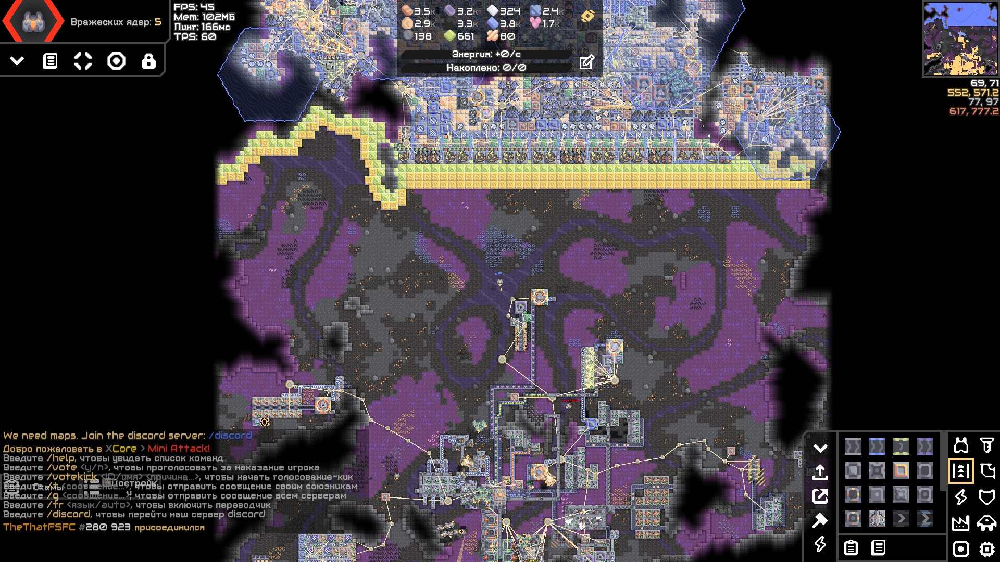

Credit: TheVanillChaos

License: **GPL-3.0-only**. [license](https://www.gnu.org/licenses/gpl-3.0.html).

[Exact file-page evidence](https://commons.wikimedia.org/w/index.php?title=File%3AMindustry+multiplayer.jpg&oldid=1221300694) · [Original image](https://upload.wikimedia.org/wikipedia/commons/c/cf/Mindustry_multiplayer.jpg) · [Game source](https://github.com/Anuken/Mindustry)

Capture date: 2024-08-22 (source_declared). Uploaded: 2024-08-22T01:08:22Z. Downloaded: 2026-09-10T17:32:37.260932+00:00.

Historical image; relation to indexed source commit is unknown. Not a current build or play attestation. Scope review concerns this exact image only, not all game assets or source extraction. Exact file-page template specifies GPLv3 only; later versions are not asserted.

Changes: Original image bytes retained unchanged; contact sheet scales an independent copy to fit, without content edits.

SHA256: `ccd61327d310a6ee30db6e2f5998d643a3ef40d69ec1e2396354d615e0a6bf37`. Dimensions: 1920 × 1080.

## 09. Endless Sky

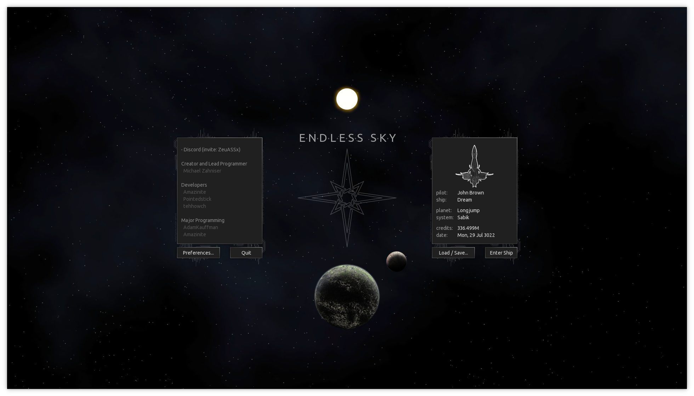

Credit: Endless Sky developers

License: **GPL-3.0-or-later**. [license](https://www.gnu.org/licenses/gpl-3.0.html).

[Exact file-page evidence](https://commons.wikimedia.org/w/index.php?title=File%3AEndless+Sky+0.9.12+title+screen.png&oldid=950568784) · [Original image](https://upload.wikimedia.org/wikipedia/commons/d/d0/Endless_Sky_0.9.12_title_screen.png) · [Game source](https://github.com/endless-sky/endless-sky)

Capture date: 2020-09-12 (source_declared). Uploaded: 2020-09-12T13:25:19Z. Downloaded: 2026-09-10T17:32:37.260932+00:00.

Historical image; relation to indexed source commit is unknown. Not a current build or play attestation. Scope review concerns this exact image only, not all game assets or source extraction.

Changes: Original image bytes retained unchanged; contact sheet scales an independent copy to fit, without content edits.

SHA256: `714296ffa5e172f621be9297376b3280a670fb709d20ffeebbd628fae6a82724`. Dimensions: 1960 × 1120.

## 10. Cataclysm: Dark Days Ahead

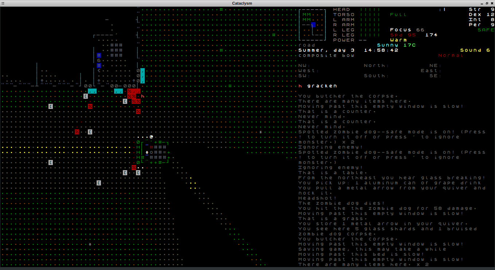

Credit: tivasyk

License: **CC-BY-SA-3.0**. [license](https://creativecommons.org/licenses/by-sa/3.0/).

[Exact file-page evidence](https://commons.wikimedia.org/w/index.php?title=File%3ACDDA+0.A+screenshot+humvee.png&oldid=1105531411) · [Original image](https://upload.wikimedia.org/wikipedia/commons/0/00/CDDA_0.A_screenshot_humvee.png) · [Game source](https://github.com/CleverRaven/Cataclysm-DDA)

Capture date: 2014-11-05 (source_declared). Uploaded: 2014-11-05T12:52:38Z. Downloaded: 2026-09-10T17:32:37.260932+00:00.

Historical image; relation to indexed source commit is unknown. Not a current build or play attestation. Scope review concerns this exact image only, not all game assets or source extraction.

Changes: Original image bytes retained unchanged; contact sheet scales an independent copy to fit, without content edits.

SHA256: `08891402a111738a0dc43f410b5ef784e37b7fed7faf6143a91c6fdb1f30f677`. Dimensions: 1358 × 741.

## 11. 2048

Credit: Gabriele Cirulli

License: **MIT**. [license](https://opensource.org/license/mit).

[Exact file-page evidence](https://commons.wikimedia.org/w/index.php?title=File%3A2048+Screenshot.png&oldid=774775920) · [Original image](https://upload.wikimedia.org/wikipedia/commons/6/64/2048_Screenshot.png) · [Game source](https://github.com/gabrielecirulli/2048)

Capture date: 2014-03-19 12:20:41 (source_declared). Uploaded: 2014-03-19T16:21:39Z. Downloaded: 2026-09-10T17:32:37.260932+00:00.

Historical image; relation to indexed source commit is unknown. Not a current build or play attestation. Scope review concerns this exact image only, not all game assets or source extraction.

Changes: Original image bytes retained unchanged; contact sheet scales an independent copy to fit, without content edits.

SHA256: `fda05378852e68a61e1607cf91082ec774356078c5c4af64e5684c50a40b9d6f`. Dimensions: 548 × 549.

## 12. Veloren

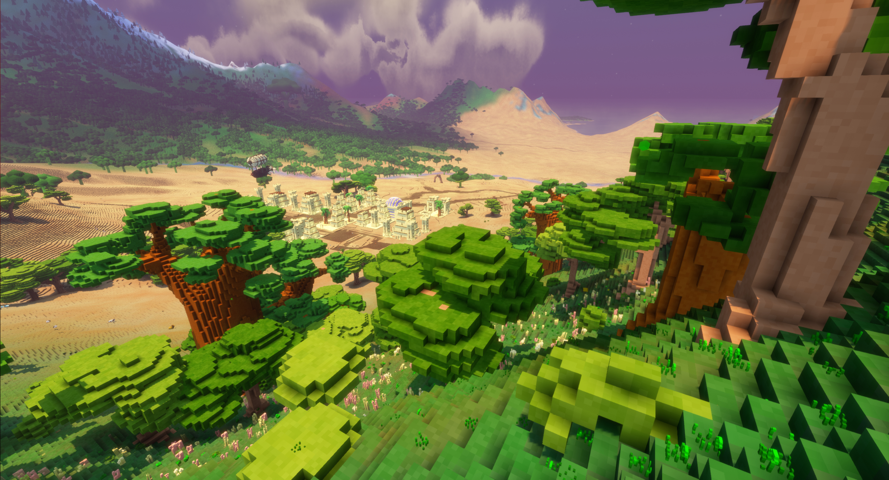

Credit: Veloren Project

License: **GPL-3.0-or-later**. [license](https://www.gnu.org/licenses/gpl-3.0.html).

[Exact file-page evidence](https://commons.wikimedia.org/w/index.php?title=File%3AVeloren+Savannah+Screenshot.jpg&oldid=1206827967) · [Original image](https://upload.wikimedia.org/wikipedia/commons/f/fc/Veloren_Savannah_Screenshot.jpg) · [Game source](https://gitlab.com/veloren/veloren)

Capture date: 2023-01-18 (source_declared). Uploaded: 2024-02-27T04:16:39Z. Downloaded: 2026-09-10T17:32:37.260932+00:00.

Historical image; relation to indexed source commit is unknown. Not a current build or play attestation. Scope review concerns this exact image only, not all game assets or source extraction.

Changes: Original image bytes retained unchanged; contact sheet scales an independent copy to fit, without content edits.

SHA256: `7fe1da94be67834d6a1e5cd1be3a0937e9a261587d1dd5ee2644896e8bd44bee`. Dimensions: 2520 × 1362.
